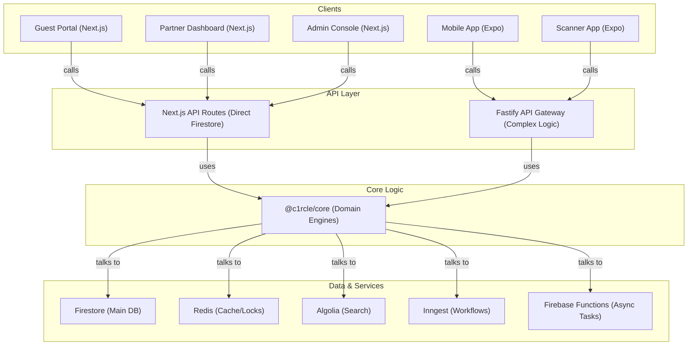

# System Overview

**C1rcle** is a production-grade event discovery and ticketing platform designed for urban India (Pune, Mumbai, Bengaluru, Goa). The system enables event hosts (partners/venues) to create and manage events, while guests can discover events, book tickets, manage profiles, and participate in a social event ecosystem.

The system is designed to handle high-traffic event launches, complex ticket inventory management, surge pricing, and secure QR-based check-ins.

# High-Level Architecture

The project follows a **Monorepo** architecture (managed by Turborepo) where shared business logic and UI components are centralized, while multiple client applications and services are decoupled but integrated.



# Technology Stack

| Layer | Technologies |
|-------|--------------|
| **Monorepo** | Turborepo, npm workspaces |
| **Frontend (Web)** | Next.js 14 (App Router), React 18, TailwindCSS, Framer Motion, Three.js, GSAP |
| **Mobile** | Expo (React Native), Expo Router, NativeWind, React Native Reanimated |
| **Backend (API)** | Next.js API Routes, Fastify (Gateway), Firebase Cloud Functions |
| **Database** | Firebase Firestore (NoSQL), Redis (ioredis) |
| **Authentication** | Firebase Auth |
| **State Management** | Zustand, TanStack React Query |
| **Integrations** | Algolia (Search), Razorpay (Payments), Inngest (Workflows), Sentry (Monitoring), Resend (Email), Gemini (AI) |
| **Infrastructure** | Vercel (Web), Firebase (Functions/Auth), GitHub Actions (CI/CD) |

# Component Architecture

The system is split into multiple independent applications and shared packages:

### Frontend Applications
*   **Guest Portal**: The primary discovery engine for users. High-fidelity UI with 3D elements and smooth animations.
*   **Partner Dashboard**: Operational tool for event hosts to manage listings, tickets, and analytics.
*   **Admin Console**: Internal operations tool for managing the entire platform.
*   **Mobile/Scanner Apps**: Mobile clients for guest convenience and operational efficiency (QR scanning).

### Backend Services
*   **Next.js API Routes**: Dedicated backends for each web app, providing direct, low-latency Firestore access.
*   **Fastify API Gateway**: A centralized TypeScript backend used for complex business logic, mobile app support, and real-time features (WebSockets).
*   **Firebase Functions**: Serverless environment for asynchronous background tasks, webhooks, and heavy processing.

### Shared Packages
*   **@c1rcle/core**: The "brain" of the system. Contains domain-specific "engines" (Event, Order, Ticket, Pricing, Payout, etc.) and shared infrastructure logic.
*   **@c1rcle/ui**: A shared design system and component library.
*   **@c1rcle/types**: Shared TypeScript interface definitions for consistency across the monorepo.

# Data Flow

1.  **Request**: User interacts with a Client (e.g., Guest Portal).
2.  **Logic**: The client calls a local API route (Next.js) or the Fastify Gateway.
3.  **Domain**: The API layer invokes the relevant "Engine" from `@c1rcle/core`.
4.  **Database**: The Engine performs operations on Firestore or checks/sets data in Redis.
5.  **External**: If needed, the Engine triggers external services (e.g., razorpay for payment, inngest for workflows, algolia for search indexing).
6.  **Response**: Data flows back through the layers to update the UI (often utilizing React Query for caching).

# API Architecture

*   **Service-Specific**: Next.js apps call their own internal `/app/api/*` routes. These routes have direct access to `firebase-admin` for high-speed Firestore operations.
*   **Gateway**: The Fastify Gateway provides a versioned REST API (`/api/v1/*`) with:
    *   Zod-based request validation.
    *   Redis-based caching and rate limiting.
    *   Unified error handling.
*   **Engines**: All heavy lifting is abstracted into engines in `@c1rcle/core`, ensuring that the same business rules apply regardless of which API is calling them.

# State Management

*   **Server State**: Managed by **TanStack React Query**. Handles fetching, caching, synchronization, and optimistic updates.
*   **Client State**: Managed by **Zustand**. Used for UI state (modals, filters, user session context, navigation state).
*   **Persistence**: Critical client state (like user preferences or discovery filters) is persisted to local storage/async storage via Zustand middleware.

# Database Architecture

*   **Firestore**: The primary source of truth. Data is structured in hierarchical collections:
    *   `events`: Root collection for all event data.
    *   `users`: User profiles, settings, and metadata.
    *   `orders`: Transaction records and ticket allocations.
    *   `venues`/`hosts`: Partner-specific information.
*   **Schema**: Optimized for read performance with denormalized data where appropriate.
*   **Redis**: Used for:
    *   Distributed locking (preventing race conditions during ticket booking).
    *   API response caching for expensive queries.
    *   Real-time counters.

# Folder Structure

```
thec1rcle/
├── apps/               # Individual deployable applications
│   ├── guest-portal/
│   ├── partner-dashboard/
│   ├── admin-console/
│   ├── api-gateway/
│   └── mobile-app/
├── packages/           # Shared workspace packages
│   ├── core/           # Business logic (Domain Engines)
│   ├── ui/             # Shared React components/Design System
│   └── types/          # Global TypeScript definitions
├── functions/          # Firebase Cloud Functions (Background tasks)
├── packages/core/src/  # Core logic source code
│   ├── domain/         # Domain-driven interfaces and rules
│   └── infrastructure/ # Database/Auth implementation details
└── scripts/            # Maintenance, seeding, and dev scripts
```

# Integration Points

*   **Authentication**: Firebase Auth (Email/Phone, Google, Apple ID).
*   **Payments**: Razorpay (Web and Mobile integrations).
*   **Search**: Algolia (Synchronized via `@c1rcle/core/search.js` and Firebase Functions).
*   **Workflows**: Inngest for delayed tasks (e.g., order expiry, cleanup).
*   **Emails**: Resend for transactional alerts.
*   **Monitoring**: Sentry for error logging and Tracing.

# Deployment Architecture

*   **Hosting**:
    *   Web Apps: Deployed to **Vercel**.
    *   API Gateway: Dockerized and deployed to **Google Cloud (GCP/GKE)** or similar container service.
    *   Background Logic: **Firebase Functions**.
*   **CI/CD**: Managed via **GitHub Actions**. Automated builds, tests, and deployments for `staging` and `production` branches.

# Architectural Principles

1.  **Stability over Style**: Prefer working, stable code over experimental pattern changes.
2.  **Domain Isolation**: Business logic belongs in `@c1rcle/core` "Engines," not in UI components or API handler skins.
3.  **Conservative Modification**: Change the minimum code required to fix a bug or add a feature.
4.  **Shared Foundation**: Use shared packages (`ui`, `core`, `types`) to ensure consistency and reduce duplication across the frontend and mobile apps.
5.  **Performance by Default**: Utilize server-side rendering, GPU-accelerated animations, and aggressive caching (Redis/React Query) to maintain a premium feel.
