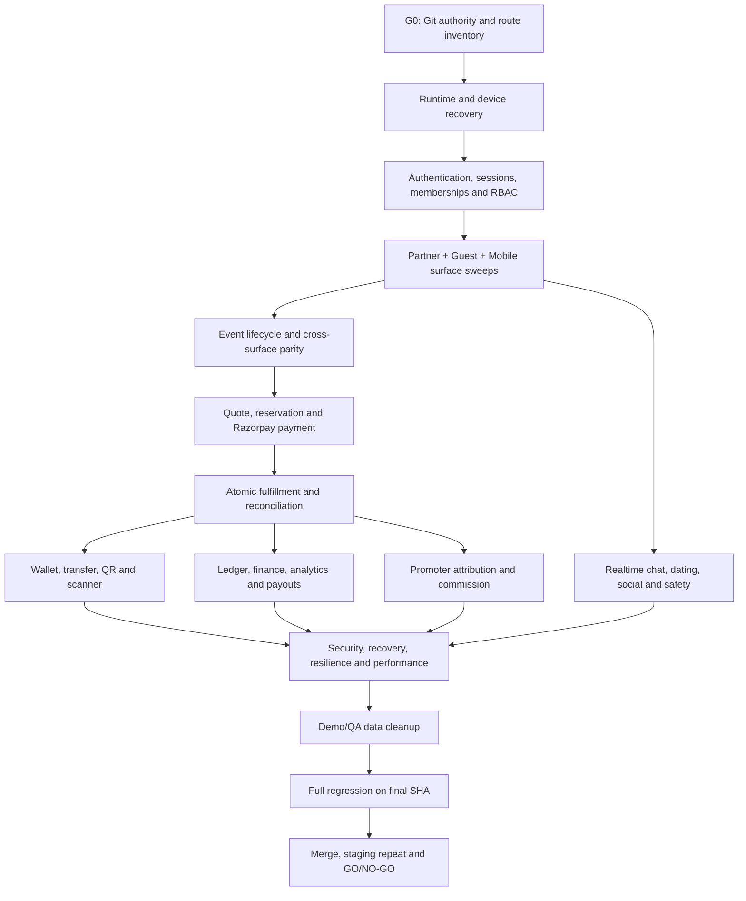

# THE C1RCLE Full Ecosystem Launch Completion Plan

**Controlling evidence:** `docs/FULL_ECOSYSTEM_MANUAL_QA_EVIDENCE_REPORT.md`  
**Authoritative checkout:** `/Users/aayushdivase/Desktop/thec1rcle`  
**Target branch:** `pre-staging`  
**Current frozen baseline:** `bce259da564bf2c66de2cef8252b0e7930fa5de6`  
**Current headline matrix:** 14 PASS / 17 Pending  
**Current verdict:** **NO-GO — execution incomplete**

This plan controls the remaining audit, remediation, evidence collection, Git
closeout, and launch verdict. It does not treat a rendered page, passing unit
test, successful build, or reachable API as end-to-end proof. A feature passes
only when its user action, frontend state, network contract, Gateway
authorization, Core behavior, persistence, cache/realtime behavior, provider
state, recovery behavior, and negative security cases have been observed.

---

## 1. Completion contract

Launch completion requires all of the following:

1. Every tracked Partner Dashboard page/API route, Guest Portal page/API route,
   Mobile screen, Scanner screen, Gateway route, modal, and mutation is present
   in a route/screen manifest.
2. Every manifest row has a final state of `PASS`, `REMOVED`, or
   `INTENTIONALLY_UNAVAILABLE`.
3. `INTENTIONALLY_UNAVAILABLE` is valid only when the control is absent from the
   release UI, the API fails closed, and the product behavior is documented.
4. No row may remain `PENDING`, `PARTIAL`, `BLOCKED`, `SKIPPED`, or
   `UNPROVEN`.
5. Every discovered defect is reproduced, classified, repaired or safely
   removed, tested, rerun in the live journey, and recorded under
   `### 🛠️ WORKAROUNDS & CODE EDITS APPLIED DURING QA`.
6. Commerce reconciliation differs by zero paise and zero admission units.
7. The physical Android build, Razorpay test provider, Firebase, Redis,
   Gateway, Guest Portal, Partner Dashboard, and Scanner use one approved
   staging environment.
8. All P0/P1 findings are closed with evidence.
9. The exact final commit passes all automated and manual gates.
10. Promotion occurs only through:
    `feature branch → pre-staging → staging → repeated E2E → main`.

### Evidence states

| State | Meaning |
|---|---|
| `PENDING` | Not executed against the current frozen SHA |
| `IN_PROGRESS` | Execution started; final assertions incomplete |
| `FAIL` | Reproducible product, data, contract, environment, or security defect |
| `BLOCKED` | External prerequisite absent; other independent work continues |
| `PASS` | Required positive, negative, recovery, and evidence checks passed |
| `REMOVED` | Dead/legacy feature removed with route/import/telemetry proof |
| `INTENTIONALLY_UNAVAILABLE` | Launch-disabled, absent from UI, and API fails closed |

### Fix protocol

Before any source edit:

1. Reproduce the failure and retain the exact route, payload, response,
   screenshot, log, and correlation ID.
2. Trace the full boundary:
   `UI → client service/BFF → Gateway route → Core workflow → Firestore/Redis/provider`.
3. Identify the canonical authority and all dependent consumers.
4. Make the smallest safe fix. Do not perform opportunistic architectural
   rewrites during manual QA.
5. Add or update contract, unit, integration, authorization, and recovery tests.
6. Run package type-check and focused tests.
7. Rerun the original live journey.
8. Record the triggering issue, fix, files, before/after behavior, validation,
   remaining risk, and rollback.

---

## 2. Exact scope inventory

The repository currently contains approximately:

| Surface | Source entries to classify |
|---|---:|
| Partner Dashboard `page`/`route` files | 328 |
| Guest Portal `page`/`route` files | 55 |
| Mobile App source screens/routes | 109 |
| Gateway route modules | 73 |

These counts are discovery inputs, not PASS evidence. Phase 0 must generate
machine-readable manifests from the final worktree and classify:

- UI page or screen;
- API/BFF route;
- dynamic route and required fixture;
- persona and permission;
- public or protected;
- primary actions and modals;
- upstream endpoint;
- positive case;
- negative/cross-tenant case;
- recovery/offline/retry case;
- evidence path;
- defect IDs;
- final status.

**Required manifest artifacts**

- `qa-artifacts/manifests/partner-dashboard-routes.json`
- `qa-artifacts/manifests/guest-portal-routes.json`
- `qa-artifacts/manifests/mobile-routes.json`
- `qa-artifacts/manifests/scanner-routes.json`
- `qa-artifacts/manifests/gateway-routes.json`
- `qa-artifacts/manifests/feature-to-endpoint-map.json`
- `qa-artifacts/manifests/coverage-summary.json`

The final coverage summary must show zero unclassified and zero incomplete rows.

---

## 3. Dependency-ordered execution



If Android or a provider is temporarily unavailable, continue all independent
Guest, Partner, Gateway, Core, authorization, and browser work. The missing
device/provider gate remains a NO-GO until restored; it is never waived.

---

## 4. Phase 0 — Authority, Git safety, and runtime recovery

### 0.1 Re-establish Git authority

1. Record:
   - `pwd`
   - current branch and HEAD;
   - `git worktree list --porcelain`;
   - local/remote `pre-staging` SHAs;
   - merge base;
   - tracked and untracked status.
2. Fetch `origin/pre-staging`.
3. Classify current modifications into:
   - QA remediation owned by this run;
   - pre-existing user changes;
   - generated evidence;
   - protected archive/recovery directories.
4. Preserve all user-owned and unrelated changes.
5. Checkpoint QA remediation on a focused `codex/` feature branch after diff
   review; do not commit recovery trees, secrets, runtime environment files,
   `node_modules`, old module quarantines, caches, or build products.
6. Merge/rebase the latest `origin/pre-staging` only after the current QA patch
   is safely checkpointed.
7. Resolve conflicts by intent and rerun all affected gates.
8. Freeze the resulting exact SHA and update the evidence report.

**Success:** one known feature-branch SHA contains only reviewed remediation and
evidence; its merge base with `pre-staging` is recorded; no user data is lost.

### 0.2 Prevent broad hook scans

1. Confirm Git staging contains no `node_modules`, quarantine modules, recovery
   checkouts, `.next`, Expo, Gradle, or Turbo caches.
2. Run searches and checks against tracked files or explicit application roots.
3. Confirm stylelint already ignores `**/node_modules/**`.
4. Do not change hook/pipeline behavior merely to bypass a failure.
5. If a hook scans a backup tree, record the exact command and exclude the
   untracked tree from the worktree/index rather than weakening the check.

**Success:** the real hook checks application source only and finishes without
walking dependency or backup trees.

### 0.3 Restore the local staging stack

1. Put `/opt/homebrew/opt/node@20/bin` first in `PATH`.
2. Start and prove Redis on `127.0.0.1:6379`.
3. Start Gateway on port 4000 with approved staging Firebase and Razorpay test
   configuration. Supply missing secrets only through process/secret
   management; never print them.
4. Build/start Guest Portal on port 3000.
5. Build/start Partner Dashboard on port 3001.
6. Prove `/health`, Firestore, Redis, and public/internal API connectivity.
7. Preserve the existing restriction: the QA-only encryption key cannot prove
   existing encrypted finance data.

**Success:** all services return 200, Gateway health reports Firebase and Redis
healthy, and the active process paths point to the authoritative checkout.

### 0.4 Restore the Android runtime

1. Reconnect `RF8N3166GEW`; prove `adb devices -l` reports `device`.
2. Compare the outer checkout, nested checkout, and `.nosync` checkout.
3. Prove which source tree, branch, SHA, environment file, package ID, and
   Metro process produce the installed app.
4. Use the authoritative/current source; do not unknowingly test a stale nested
   runtime.
5. Configure:
   - `adb reverse tcp:4000 tcp:4000`;
   - the active Metro port, normally `tcp:8082`;
   - any Scanner port required by the selected build.
6. Build/install the native Expo development client with native Razorpay and
   Firebase modules.
7. Capture app version, build fingerprint, device model, Android version,
   package ID, and initial logcat.

**Success:** the foreground device app reaches the healthy Gateway and its
source SHA/environment are proven.

---

## 5. Phase 1 — Evidence harness and account matrix

### 1.1 Evidence collection

For every browser route:

- final URL and HTTP status;
- screenshot;
- visible-content assertion;
- console warnings/errors;
- page errors;
- failed resources;
- API request/response statuses;
- accessibility snapshot for critical forms;
- action-specific payload with secrets and tokens redacted.

For every Android screen:

- screenshot or recording;
- foreground activity and route;
- logcat window;
- network/correlation ID;
- taps and visible result;
- cold-start/relaunch behavior;
- offline/background/foreground behavior where applicable.

For every mutation:

- authenticated principal and partner membership;
- request ID/idempotency key;
- before/after authoritative state;
- Redis/cache/realtime result;
- provider result;
- replay/duplicate result;
- cross-tenant/forged-payload result.

### 1.2 Account matrix

Use the existing tagged accounts and add only the minimum fixtures required:

- primary Guest;
- secondary Guest;
- Venue owner;
- Host owner;
- Promoter;
- Door staff;
- muted/removed chat user;
- unrelated cross-tenant Partner;
- blocked dating/social pair;
- supervisor/finance-capable role where an existing approved role requires it.

All additions must use `[QA-TEST-2026]`, be listed for cleanup, and must not
grant broader privileges than the tested journey requires.

---

## 6. Phase 2 — Authentication, session, membership, and RBAC closure

### Partner Dashboard

Test:

- `/login`, `/auth`;
- `/forgot-password`;
- `/auth/change-password`;
- `/auth/staff-invite`;
- `/onboard`, `/verify`;
- Venue/Host/Promoter login;
- session reload and logout;
- multi-organization switching;
- inactive membership;
- invited staff acceptance;
- KYC identity, tax, and bank states.

Primary source areas:

- `apps/partner-dashboard/app/login/`
- `apps/partner-dashboard/app/auth/`
- `apps/partner-dashboard/app/onboard/`
- `apps/partner-dashboard/app/verify/`
- `apps/partner-dashboard/components/providers/DashboardAuthProvider.tsx`
- Partner auth/session BFF routes
- Gateway auth and membership plugins
- `packages/core/src/infrastructure/auth/`

### Guest Portal

Test:

- `/login`, `/signup`, `/auth/callback`;
- email/password and OTP;
- forgot password;
- CSRF cookie/header pairing;
- session persistence;
- logout/revocation;
- protected redirect;
- invalid, expired, revoked, and disabled credentials.

### Mobile and Scanner

Test:

- first-run, auth, OTP, forgot password;
- account resume on relaunch/second device;
- disabled/revoked account;
- scanner session minting;
- event/venue/device/permission scope;
- ordinary user attempting scanner actions.

### Mandatory adversarial matrix

- Bearer submitted as Cookie and Cookie submitted as Bearer;
- conflicting credentials;
- forged `role`, `partnerId`, `venueId`, `hostId`, `actorId`, `deviceId`;
- door staff reading finance;
- unrelated Partner reading events, attendees, payouts, or ledger;
- inactive membership;
- stale custom claims;
- direct BFF and direct Gateway invocation.

**Success:** every protected operation authenticates the correct credential
type, checks current account/membership state, enforces an explicit permission,
and fails closed before business logic.

---

## 7. Phase 3 — Partner Dashboard exhaustive closure

Each route must be tested with its correct persona and at least one wrong
persona. Every visible CTA, row action, filter, export, modal, pagination
control, empty state, retry control, and destructive confirmation must execute
real behavior or be absent.

### 3.1 Shared components and overlays

Test:

- `AddTicketModal`;
- `GuestlistModal`;
- `EditProfileModal`;
- `HostVerificationForm`;
- `AuthModal`;
- `BuyTicketsModal`;
- legacy `CreateEventForm`.

Required decision:

- `CreateEventForm` must have no production consumer; `/create` must route to
  the V2 role-aware wizard.

### 3.2 Venue persona

Test all routes and nested tabs under:

- Overview `/venue`;
- Calendar `/venue/calendar`;
- Events `/venue/events`, `/venue/requests`, `/venue/events/[id]`;
- Creator `/venue/create`, `/venue/create/select-venue`,
  `/venue/create/select-venue/calendar`;
- Guest operations `/venue/guest-ops`;
- Tables `/venue/tables`;
- Door `/venue/door`, `/venue/walk-ins`, `/venue/registers`;
- Administration `/venue/staff`, `/venue/security`, `/venue/menu`,
  `/venue/orders`, `/venue/crm`;
- Analytics `/venue/analytics` and all drilldowns;
- Finance `/venue/finance` and payout/settings/history views;
- Marketing/network `/venue/marketing`, `/venue/partnerships`,
  `/venue/connections`, `/venue/page-management`, `/venue/presence`,
  `/venue/settings`, `/venue/support`.

Critical mutations:

- calendar blackout/open slot;
- host request approve/reject;
- draft/edit/publish/cancel event;
- tier changes;
- guest-list rule/exception;
- staff invite/permission/revoke;
- table create/hold/assign/cancel;
- walk-in and cover charge;
- menu/order state;
- CSV/export;
- bank/payout reads and any enabled mutations.

### 3.3 Host persona

Test:

- `/host`;
- `/host/create` and venue/calendar selection;
- `/host/events`, `/host/requests`, `/host/events/[id]`;
- `/host/calendar`, `/host/audience`, `/host/discover`,
  `/host/promoters`, `/host/partnerships`;
- `/host/ops`, `/host/analytics`, `/host/finance`, `/host/payouts`,
  `/host/wallet`;
- `/host/page-management`, `/host/team`, `/host/reviews`,
  `/host/presence`, `/host/notifications`, `/host/profile`,
  `/host/settings`, `/host/support`.

Critical mutations:

- venue partnership/request;
- Host event submission and Venue approval;
- team invite and event assignment;
- promoter assignment/terms;
- attendee search/export;
- finance and payout controls;
- public-page edits.

### 3.4 Promoter persona

Test:

- `/promoter`;
- `/promoter/links`;
- `/promoter/stats`, `/promoter/guests`;
- `/promoter/events`, `/promoter/events/[assignmentId]`,
  `/promoter/leaderboard`;
- `/promoter/finance`, `/promoter/commissions`, `/promoter/payouts`,
  `/promoter/wallet`, `/promoter/partnerships`, `/promoter/profile`,
  `/promoter/settings`, `/promoter/notifications`.

Critical mutations:

- approved assignment;
- tracking link and UTM generation;
- discount code;
- link revoke/expiry;
- VIP/guest-list action;
- conversion and commission read;
- payout state display.

**Partner success:** every classified route and control passes with zero
unexpected 4xx/5xx, console/page/resource failures, cross-role leakage, fixture
finance, dead CTA, or direct browser-side financial authority.

---

## 8. Phase 4 — Guest Portal exhaustive closure

### 4.1 Public discovery and content

Test:

- `/`;
- `/explore`: genre, mood, price, distance, date, sort, search, pagination,
  map, empty state, refresh;
- `/event/[eventId]`, `/e/[eventId]`, `/[handle]/[eventSlug]`;
- `/event/[eventId]/queue`;
- `/venues`, `/venue/[slug]`, `/venue/[slug]/menu`;
- `/hosts`, `/host/[slug]`;
- `/interviews/[slug]`;
- `/profile/[userId]`;
- vanity `/<handle>`;
- `/about`, `/terms`, `/privacy`, `/app`, not-found.

Verify event lifecycle, poster, location, host, venue, price, currency, tiers,
availability, queue, cancellation, sell-out, and cache invalidation against the
Gateway.

### 4.2 Referral and authentication

Test `/refer/[linkId]` through checkout and prove:

- validated assignment;
- persisted `promoterId` and `promoterLinkId`;
- safe redirect;
- expiry/revocation;
- no client-selected commission.

### 4.3 Commerce and wallet

Test:

- `/checkout/[eventId]`;
- `/confirmation/[orderId]`;
- `/tickets`;
- `/ticket/[id]`;
- `/tickets/claim/[token]`;
- `/tickets/pair/[token]`;
- `/profile`.

Exercise:

- quantity changes;
- duplicate tier inputs;
- limits;
- promo codes;
- timer expiry;
- reservation cancel/recreate;
- interrupted redirect;
- refresh/recovery;
- Razorpay success/failure/cancel;
- wallet refresh;
- ticket transfer/claim;
- unauthorized order/ticket reads.

### 4.4 Guest modals

Test:

- `AuthModal` and `VerifyPanel`;
- `CheckoutContainer`;
- `CancelOrderModal`;
- `GuestlistModal`;
- `QRTicket`;
- `EditProfileModal`;
- `ProfileCompletionPrompt`;
- `GenderSelector`.

**Guest success:** every route and modal uses the typed Gateway contract,
preserves CSRF/session rules, displays no demo or stale authoritative data, and
recovers from refresh/provider interruption without duplicate payment.

---

## 9. Phase 5 — Physical Android Mobile exhaustive closure

All checks run on the proven native build. Emulator/web evidence cannot replace
physical-device evidence.

### 5.1 First-run and authentication

Test:

- `(first-run)`: city, identity, intent, phone, optional email, tastes;
- `(nightlife-onboarding)`: intro, photos, prompts, vibes, vitals;
- `(auth)`: login, signup, phone, six-digit OTP, forgot password;
- `/social-setup`;
- `/verification` selfie and ID.

Verify server persistence after app kill, relaunch, logout/login, and second
device/account.

### 5.2 Primary navigation

Test every tab:

- Explore;
- Venues;
- Wallet/Tickets;
- Inbox/Chat;
- Dating;
- Profile.

For each: cold entry, tab switching, refresh, empty/loading/error/retry,
background/foreground, deep link, and notification entry.

### 5.3 Discovery and event commerce

Test:

- `/map`;
- `/events/feed`;
- `/search`;
- `/waitlist/[eventId]`;
- `/event/[id]`;
- `/checkout/[eventId]`;
- `/checkout/success`;
- `/going/[orderId]`.

Verify the same event, lifecycle, price, tiers, availability, limits, timer,
quote, and order as Guest Portal.

### 5.4 Wallet and transfer

Test:

- `/ticket/[id]`;
- 15-second QR rotation;
- screenshot/background behavior;
- Google Wallet export;
- transfer create/cancel/claim/expiry;
- old-owner QR rejection;
- Smart Pass pairing.

### 5.5 Scanner

Test:

- scan camera;
- Door event code;
- manual guest-list search;
- walk-in ticket;
- cover-charge deduction;
- entrance statistics;
- online-only failure state.

### 5.6 Social, chat, and dating

Test:

- `/chat/[id]`;
- event chat;
- DM;
- image attachment;
- reply/thread persistence;
- reconnect/catch-up;
- `/social/attendees`;
- `/social/contacts`;
- `/dating/[id]`;
- `/dating/match`;
- `/social/report`.

### 5.7 Safety and settings

Test:

- `/safety`;
- SOS;
- trusted-buddy location;
- fake call;
- emergency contact addition;
- Settings;
- Help;
- Legal.

### 5.8 Mobile overlays

Test:

- `AuthSheet`;
- `GuestlistSheet`;
- `HostSheet`;
- `VenueSheet`;
- ticket action sheets;
- cover deduction;
- country code picker;
- anthem player.

**Mobile success:** every manifest screen opens on the physical device, all
server-backed actions persist, deep links/notifications resolve to existing
routes, and there are no release demo paths, localhost mismatches, crashes,
unhandled promise rejections, or stale local authority.

---

## 10. Phase 6 — Canonical event and commerce chain

### 6.1 Event lifecycle parity

Execute Venue-created and Host-submitted events through:

- draft;
- edit;
- submit;
- approve;
- publish;
- tier edit;
- sell-out;
- cancel.

At each transition compare:

- Firestore event;
- public discovery read model;
- Guest;
- Mobile;
- Partner;
- Redis/cache tags;
- availability slot.

**SLA:** public propagation must be measured, not estimated.

### 6.2 Quote and reservation

Test:

- two paid tiers;
- free/RSVP;
- duplicate rows;
- per-tier/order limits;
- concurrent holds;
- 10-minute expiry;
- edit/cancel/recreate;
- Redis lock ownership/loss;
- Redis outage;
- Firestore/Redis reconciliation;
- stale order cleanup.

### 6.3 Razorpay test payment

Run at minimum:

1. Guest callback first.
2. Webhook first.
3. Simultaneous callback/webhook.
4. Duplicate callback.
5. Duplicate webhook.
6. Mobile native payment.
7. Cancelled/failed payment.
8. Captured payment with transient finalization failure.
9. Amount/currency mismatch.
10. Same provider payment against a second order.
11. Authorized but not captured.

Record provider order/payment IDs without exposing secrets.

### 6.4 Atomic fulfillment reconciliation

For every successful purchase prove one transaction produced:

- confirmed order;
- verified payment;
- exact reservation conversion;
- exact inventory delta;
- deterministic ticket per admission;
- deterministic entitlement per admission;
- complete `partner_ledger` posting set;
- `partner_ledger_idempotency/{orderId}`;
- one durable outbox event.

Reconcile:

`gross = platform fee + venue share + promoter commission + host payout`

All values are integer paise. Replay must create zero additional artifacts.

### 6.5 Refunds

Test:

- full refund;
- exact-ticket partial refund;
- provider pending/webhook;
- replay;
- ticket/entitlement revocation;
- exact negative ledger references;
- projection rebuild.

**Commerce success:** no oversell, no second charge, no confirmed order without
all artifacts, no marker without referenced artifacts, and zero-paise
reconciliation.

---

## 11. Phase 7 — Wallet, scanner, finance, promoter, tables, and cover charge

### 7.1 Wallet and scanner

1. Purchase two admissions.
2. Prove both appear without relaunch.
3. Validate rotating signed QR issuer, audience, event, ticket, entitlement,
   owner, expiry, and revocation.
4. Scan each admission independently.
5. Reject replay, wrong event, expiry, transfer, revocation, inactive
   entitlement, unauthorized operator/device, and raw ID.
6. Verify couple-ticket preview and atomic two-person confirmation.
7. Deny offline scanning explicitly.

### 7.2 Partner operations and SLA

Measure ten purchases:

| Measurement | Required p95 |
|---|---:|
| Finalization commit → door/guest list | <3 seconds |
| Finalization commit → KPI | <5 seconds |
| Finalization commit → aggregate graph | <15 seconds |

Verify buyer name, order number, ticket IDs, check-in state, sold count, gross,
fees, net balance, and event analytics.

### 7.3 Promoter attribution

1. Create an approved assignment and link.
2. Open through Guest referral.
3. Purchase.
4. Prove immutable order attribution.
5. Prove commission uses server-owned assignment terms.
6. Reconcile click, conversion, order, ledger, aggregate, and Promoter UI.
7. Reject forged percentage, expired link, unassigned event, and duplicate
   conversion.

### 7.4 Tables

Test:

- table create/edit/delete;
- quote and hold;
- concurrent purchase;
- payment and assignment;
- cancellation/refund;
- minimum spend;
- server assignment;

**Success:** table inventory, holds, payments, ledger entries, assignments,
cancellations, and refunds are deterministic and cross-tenant actions fail
closed.

### 7.5 Cover Charge Engine — mandatory end-to-end launch gate

Cover Charge is a standalone financial and access-control subsystem. It must be
audited across Core, payment fulfillment, Gateway, Redis, Firestore, Partner
Dashboard, the launch Scanner surface, and the Guest wallet. It cannot pass from
unit tests or route reachability alone.

#### 7.5.1 Canonical files and ownership

Primary source:

- `packages/core/cover-charge-engine.js`
- `packages/core/types/cover-charge.ts`
- `packages/core/workflows/ticketing.js`
- `packages/core/guest-wallet-profile-notification-service.js`
- `apps/api-gateway/src/routes/v1/cover-charge.ts`
- `apps/api-gateway/src/routes/v1/cover-charge.security.test.ts`
- `apps/mobile-app/lib/scanner/api.ts`
- `apps/mobile-app/lib/scanner/types.ts`
- `apps/mobile-app/app/scanner/cover-charge.tsx`
- `apps/mobile-app/components/scanner/CoverDeductionOverlay.tsx`
- `apps/mobile-app/app/(tabs)/tickets.tsx`
- `apps/mobile-app/__tests__/scanner/cover-charge-flow.test.ts`
- `apps/scanner-app/`
- Partner Venue finance/operations/reconciliation surfaces

Authority rules:

1. Core owns wallet state transitions, balance arithmetic, idempotency,
   transaction construction, and reconciliation.
2. Gateway routes own authentication, partner/venue/event scope, device
   authorization, supervisor authorization, request validation, rate limiting,
   and response privacy.
3. Scanner and Partner clients never derive actors, roles, balances, or
   authorization locally.
4. Firestore is the durable wallet/transaction authority. Redis may enforce
   velocity and accelerate reads but cannot become financial truth.
5. All Cover Charge values are integer paise through UI parsing, APIs, Core,
   Firestore, reconciliation, exports, and tests.

#### 7.5.2 Core engine and schema audit

Audit and test:

1. Wallet issuance:
   - deterministic wallet ID per purchased cover unit;
   - exact `orderId`, ticket, entitlement, event, venue, owner, tier, currency,
     initial balance, expiry, and rules;
   - one wallet per purchased cover package;
   - replay returns the original wallet without duplicate value.
2. Integer-paise enforcement:
   - reject decimals, `NaN`, infinity, negative amounts, unsafe integers,
     strings that bypass schemas, and currency mismatch;
   - never use floating-point rupee calculations for stored value;
   - balance before/after must reconcile exactly for issue, debit, reversal,
     top-up, and correction.
3. State-transition matrix:
   - `ACTIVE`;
   - `FROZEN`;
   - `TERMINATED`;
   - `EXPIRED`;
   - every permitted transition is explicit;
   - every forbidden transition returns a typed failure without mutation;
   - terminal/expired wallets cannot be silently reactivated.
4. Debit behavior:
   - sufficient balance;
   - zero/negative amount rejection;
   - deterministic transaction ID;
   - idempotent replay;
   - no overdraft under concurrent debits;
   - preset item and free-form amount rules;
   - exact operator/device/event attribution.
5. Reversal behavior:
   - references one original debit;
   - cannot exceed or repeat the reversible amount;
   - restores the exact paise amount;
   - preserves immutable original transaction history;
   - records supervisor identity, reason, and request ID.
6. Top-up behavior:
   - exact positive paise;
   - explicit reason/source;
   - supervisor and venue attribution;
   - idempotent replay;
   - state restrictions.
7. Freeze/unfreeze/termination/expiry:
   - no debit while frozen;
   - no mutation after terminal/expired state except an explicitly supported
     administrative correction workflow;
   - timestamps and actor/reason audit fields;
   - concurrent state changes fail deterministically.
8. `generateReconciliation(eventId, venueId)`:
   - opening issued value;
   - top-ups;
   - gross debits;
   - reversals;
   - current wallet balances;
   - expired/terminated balances;
   - discrepancy;
   - wallet/transaction counts;
   - all totals in paise;
   - result equals a direct replay of immutable wallet transactions.

Required invariant:

```text
issuedPaise + topUpPaise
  = debitPaise - reversalPaise + currentBalancePaise + terminalAdjustmentsPaise
```

The exact production schema determines whether a supported terminal adjustment
bucket exists. If none exists, it must be zero. Any non-zero unexplained
discrepancy is a P0.

#### 7.5.3 Gateway route and security matrix

Test every route directly and through its UI client:

| Route | Required authority and assertions |
|---|---|
| `GET /api/v1/cover-charge/wallet/by-order/:orderId` | Authenticated order owner or explicitly authorized Venue operator; validate order, event, venue, and wallet scope; return non-enumerating 404 cross-user/cross-venue |
| `POST /api/v1/cover-charge/debit` | Valid scanner session, active bound device, permitted event/venue, ACTIVE wallet, UUID idempotency key, server-derived actor/device, Redis velocity limit |
| `POST /api/v1/cover-charge/reverse` | Active OWNER/MANAGER membership for the exact venue, valid supervisor PIN hash, original transaction, reason, event/venue scope, idempotent reversal |
| `POST /api/v1/cover-charge/top-up` | Active OWNER/MANAGER membership, valid supervisor PIN, exact venue/wallet scope, UUID idempotency key, positive integer paise |
| `POST /api/v1/cover-charge/freeze` | Authorized Venue supervisor, exact wallet scope, reason/audit event, idempotent state transition |
| `POST /api/v1/cover-charge/unfreeze` | Authorized Venue supervisor, valid source state, exact wallet scope, reason/audit event |
| `GET /api/v1/cover-charge/wallet/:walletId` | Guest owner or scoped Venue operator; apply `showBalanceToGuest` and `showTransactionHistory` without leaking hidden fields |
| `GET /api/v1/cover-charge/reconciliation` | `VIEW_FINANCIALS` for the exact Venue/event; no door-staff or cross-tenant access; persist/read `cover_wallet_reconciliations` consistently |

Velocity-limit proof:

1. Allow at most three debit attempts per minute per authorized device and
   scoped wallet/event policy.
2. The fourth request receives a typed 429 and performs no wallet write.
3. A second Gateway instance observes the same Redis limit.
4. Redis failure returns a retryable 503 before debit; it never bypasses the
   limiter.
5. Reset/expiry behavior is measured and cannot be extended inconsistently by
   failed requests.

Idempotency proof:

1. `idempotencyKey` is a valid UUID.
2. Same key + same wallet/amount/item returns the original result.
3. Same key + changed wallet, amount, item, event, venue, or device returns an
   idempotency conflict.
4. Concurrent requests with the same key create one financial transaction.
5. Client timeout/retry does not double debit or double top-up.

Supervisor proof:

1. PIN verification uses the stored hash and constant-time comparison.
2. Raw PIN/hash is never logged or returned.
3. Door staff and ordinary staff cannot reverse, top-up, freeze, or unfreeze.
4. OWNER/MANAGER authority is checked from current active membership, not a
   client role or stale claim.
5. Supervisor actions against another venue return 404/403 without leaking
   wallet or transaction data.

Privacy proof:

- `showBalanceToGuest=false` hides balance from every Guest response and UI;
- `showTransactionHistory=false` hides transaction history;
- hiding either field does not hide it from a correctly authorized Venue
  finance/operator view;
- QR payloads contain only the minimum opaque/signed claims;
- order IDs and wallet IDs cannot be enumerated cross-user.

#### 7.5.4 Client/Gateway route-contract parity

The current Mobile wallet source calls:

- `GET /api/v1/cover-charge/me`;
- `GET /api/v1/cover-charge/wallet/:walletId/qr-jwt`.

The dedicated Gateway route module must be proven to register matching,
authenticated contracts. If those routes are absent or registered elsewhere:

1. Select one canonical contract.
2. Implement the missing thin Gateway routes backed by Core, or update the
   Mobile client to the existing typed contract.
3. Add request/response schemas and generated/client types.
4. Add owner, privacy, expiry, issuer/audience, and cross-user tests.
5. Remove dead/duplicate route calls.
6. Prove the Guest wallet and QR view live after a real purchase.

Any visible wallet or QR control that calls an unregistered route is a P0.

#### 7.5.5 Bound-device and Scanner POS integration

Resolve the canonical launch Scanner surface first:

1. Inventory Cover Charge behavior in both:
   - the Mobile scanner stack under `apps/mobile-app/app/scanner/`;
   - the standalone `apps/scanner-app`.
2. If the standalone Scanner App is the launch artifact, it must implement the
   canonical Cover Charge client/overlay or intentionally deep-link to one
   approved shared implementation.
3. If the Mobile scanner stack is canonical, remove/deactivate any competing
   visible standalone Cover Charge path.
4. Do not ship two scanners with different authorization or debit semantics.

Hardware/device tests:

1. `bound_devices` contains an active binding for the exact venue and device.
2. Missing, inactive, revoked, mismatched, and copied device IDs fail closed.
3. The server derives device and operator identity from the scanner session;
   request-body identity fields are ignored/rejected.
4. `CoverDeductionOverlay` displays the scanned wallet/event and approved preset
   items.
5. Selecting an item sends its authoritative item ID and integer `amountPaise`.
6. Successful debit updates visible balance and receipt exactly once.
7. Insufficient balance, frozen/expired wallet, rate limit, wrong venue,
   duplicate request, and server failure show explicit non-success states.
8. Dismissing/reopening the overlay cannot resubmit a debit.
9. Background/foreground and camera rescan preserve the confirmed server state.

Offline hard-denial:

1. Disable device network before debit.
2. Confirm the UI shows an offline incident state before any success.
3. Confirm no local “accepted” debit is queued.
4. Restore network and prove the balance never changed.
5. Attempt replay after reconnect and prove only the explicit online action can
   mutate the wallet.

Any offline acceptance or deferred local debit is an automatic NO-GO.

#### 7.5.6 Wallet issuance and Guest experience

Execute a real Razorpay test purchase containing a cover-enabled ticket/tier:

1. The order stores the immutable cover-package snapshot before provider
   checkout.
2. Atomic payment finalization creates the ticket, entitlement, ledger posting,
   and deterministic Cover Wallet in the authoritative transaction or durable
   idempotent outbox defined by the production invariant.
3. Finalization replay produces no duplicate wallet or value.
4. The wallet is linked to the correct Guest, order, ticket/entitlement, event,
   venue, tier, and currency.
5. Guest wallet lists it without relaunch.
6. Balance and transaction history obey privacy rules.
7. A debit appears live; fallback refetch still converges when realtime delivery
   is disabled.
8. Reversal and top-up appear exactly once.
9. Freeze/unfreeze changes Guest usability and status immediately.
10. Transfer/refund/cancellation/expiry behavior cannot leave value attached to
    the wrong owner or an invalid admission.

#### 7.5.7 Partner Dashboard reconciliation

The Venue surface must expose canonical Cover Charge operations and finance
evidence appropriate to role:

- wallet/event search;
- balance/status;
- immutable debit/top-up/reversal history;
- device/operator attribution;
- freeze/unfreeze controls for authorized supervisors;
- reconciliation summary;
- discrepancy state;
- CSV/export if a visible export control exists;
- loading, empty, permission, provider/database failure, and retry states.

The UI must call typed Gateway routes only. It must not read/write Firestore or
calculate reconciliation locally.

Generate and persist/read the event+venue reconciliation under
`cover_wallet_reconciliations`. Compare the Partner report against a direct Core
transaction replay and the Guest wallet totals. A backend failure must return
`FINANCE_DATA_UNAVAILABLE` or an equivalent typed error—not a zero/empty report.

#### 7.5.8 Required automated tests

Run:

```bash
export PATH="/opt/homebrew/opt/node@20/bin:$PATH"

cd packages/core
../../node_modules/.bin/vitest run cover-charge-engine.test.ts

cd ../../apps/api-gateway
../../node_modules/.bin/vitest run \
  src/routes/v1/cover-charge.security.test.ts

cd ../mobile-app
npm test -- --runInBand --watchman=false \
  __tests__/scanner/cover-charge-flow.test.ts \
  __tests__/scanner/api.test.ts

cd ../..
npm run type-check
```

Expand tests to cover at minimum:

1. integer paise validation;
2. every wallet state transition;
3. concurrent debit;
4. debit idempotency replay/conflict;
5. insufficient balance;
6. exact reversal and duplicate reversal;
7. top-up replay/conflict;
8. freeze/unfreeze authorization;
9. wrong venue/event/operator/device;
10. inactive `bound_devices` record;
11. Redis fourth-debit limit;
12. Redis outage fail-closed;
13. supervisor PIN/role failures;
14. Guest privacy combinations;
15. wallet-by-order ownership;
16. `/me` and QR-JWT contract parity;
17. purchase issuance and finalization replay;
18. reconciliation with issue, debit, reverse, top-up, expiry, and terminal
    balances;
19. offline Scanner hard denial;
20. Partner report against Core replay.

#### 7.5.9 Required live E2E sequence

1. Venue configures a cover-enabled ticket/package with preset items and Guest
   privacy rules.
2. Guest buys it through Razorpay test checkout.
3. Prove exact atomic order/ticket/entitlement/ledger/Cover Wallet issuance.
4. Guest opens the wallet and rotating signed QR.
5. Authorized bound Scanner loads the wallet.
6. Debit three preset items within the permitted policy and reconcile each
   balance.
7. Prove the fourth rate-limited attempt writes nothing.
8. Prove offline debit writes nothing.
9. Attempt wrong-device, wrong-event, wrong-venue, and door-staff supervisor
   mutations.
10. OWNER/MANAGER reverses one debit with supervisor PIN.
11. OWNER/MANAGER top-ups, freezes, and unfreezes the wallet.
12. Guest privacy views and live balance/history behavior are verified after
    every action.
13. Venue generates the reconciliation report.
14. Direct Core replay, stored reconciliation, Partner UI, Guest wallet, and
    transaction collection agree to the paise.
15. Repeat idempotency/retry calls and prove no duplicate financial artifacts.

#### 7.5.10 Safe-fix and evidence protocol

For every Cover Charge defect:

1. Assign `QA-COVER-*` ID and severity.
2. Capture exact reproduction with secrets/PIN/token redacted.
3. Trace Scanner/Partner/Guest client → Gateway → Core → Firestore/Redis.
4. Apply the smallest safe fix at the canonical layer.
5. Add the failing case to automated tests.
6. Run Core, Gateway, Mobile/Scanner focused tests and all affected
   type-checks.
7. Rerun the physical-device/browser E2E step.
8. Record the change in
   `docs/FULL_ECOSYSTEM_MANUAL_QA_EVIDENCE_REPORT.md` under:
   `### 🛠️ WORKAROUNDS & CODE EDITS APPLIED DURING QA`.

Required Cover Charge evidence:

- `qa-artifacts/cover-charge/core-tests.log`
- `qa-artifacts/cover-charge/gateway-security-tests.log`
- `qa-artifacts/cover-charge/mobile-scanner-tests.log`
- `qa-artifacts/cover-charge/e2e-correlation.json`
- `qa-artifacts/cover-charge/device-and-offline-evidence/`
- `qa-artifacts/cover-charge/guest-wallet-evidence/`
- `qa-artifacts/cover-charge/partner-reconciliation-evidence/`
- `qa-artifacts/cover-charge/reconciliation.json`
- redacted API/network timelines and screenshots

#### 7.5.11 Cover Charge success and NO-GO rules

Cover Charge passes only when:

- every amount is an integer paise value;
- every state transition is explicit and enforced;
- one purchase issues the exact deterministic wallets;
- debit/reversal/top-up/idempotency are concurrency-safe;
- an unauthorized or unbound device cannot mutate value;
- Redis failure and offline mode deny debits before mutation;
- supervisor operations require current OWNER/MANAGER authority and valid PIN;
- Guest privacy flags are enforced;
- Partner, Guest, Core replay, Firestore, and stored reconciliation agree
  exactly;
- all client routes exist and use one canonical contract;
- all automated and live physical-device tests pass;
- the evidence report contains the complete PASS proof.

Automatic NO-GO:

- one-paise discrepancy;
- duplicate or missing wallet/value;
- overdraft;
- repeated idempotency key changes value twice;
- offline acceptance;
- inactive/unbound device debit;
- wrong-event or wrong-venue debit;
- door staff performing supervisor actions;
- raw or leaked supervisor PIN/hash;
- Guest balance/history privacy leak;
- dead `/me` or QR-JWT client route;
- reconciliation failure converted to zero/empty;
- any open/unproven P0/P1 Cover Charge defect.

---

## 12. Phase 8 — Realtime, social, dating, profiles, and safety

### 8.1 Chat/realtime

Test across Mobile and Guest where supported:

- Gateway-minted short-lived WebSocket session;
- subscription authorization and acknowledgement;
- event room;
- text/image/reply;
- DM acceptance;
- unread/read state;
- typing TTL;
- disconnect/reconnect/cursor catch-up;
- multiple Gateway instances;
- muted/removed user 403 with no broadcast;
- block closure;
- event entitlement transfer.

### 8.2 Dating and social

Test:

- server-issued candidate eligibility;
- like/pass/comment/super-like schema;
- duplicate reaction idempotency;
- mutual match;
- match conversation;
- block/report;
- blocked candidate exclusion;
- unauthorized profile 404;
- pagination and tombstones;
- moderation case and quarantine.

### 8.3 Profiles, follows, onboarding

Test:

- profile edit/photo persistence;
- public privacy;
- Host/Venue follow/unfollow;
- counter reconciliation;
- block interaction;
- app restart and cross-device state.

### 8.4 Safety and notifications

Test:

- verified emergency contacts;
- SOS durable acceptance;
- MSG91 test provider message ID and receipt;
- push receipt and invalid-token cleanup;
- truthful partial/failed result;
- location invite/accept/read/stop/revoke/expiry on two devices;
- rate limits and deduplication;
- retention cleanup.

**Success:** realtime never downgrades failed authentication, blocks apply across
all social surfaces, and safety features never report success before durable
provider acceptance.

---

## 13. Phase 9 — Security, resilience, UX, accessibility, and performance

### Security

- cross-user and cross-partner reads/mutations;
- ID enumeration;
- forged attribution and actor fields;
- replay/idempotency;
- CSRF;
- file upload type/size/path;
- QR tampering;
- open redirect;
- stale/revoked credentials;
- rate-limit bypass;
- legacy mutation route;
- sensitive error/log leakage.

### Recovery

- process restart;
- Redis outage/recovery;
- delayed/missing webhook;
- Firestore transient failure;
- cache invalidation failure;
- offline/relaunch during checkout;
- WebSocket reconnect;
- provider retry;
- app background/foreground;
- Android network loss.

### UX/accessibility

- loading, empty, error, retry, permission denied;
- keyboard/focus/labels on web;
- touch targets and back navigation on Android;
- modal close/escape/back;
- destructive confirmations;
- currency/date/timezone consistency;
- no false success;
- no blank or dead control.

### Performance

- Partner route/tab interaction latency;
- Guest SSR and client-navigation timing;
- image format/cache/size;
- Android frame timing and large-list performance;
- API p50/p95;
- Firestore query/index behavior;
- cache hit/miss;
- WebSocket delivery;
- SLA measurements.

**Success:** no P0/P1 security or resilience defect, no critical accessibility
blocker, and all launch SLAs pass.

---

## 14. Phase 10 — Data cleanup

### 14.1 Demo events

`QA-RELEASE-DATA-01` is a release-blocking P0.

1. Export IDs, ownership, dependencies, ticket/order counts, and references for
   all 13 `demo-event-*` records.
2. Confirm none belongs to a supported live test/provider dependency.
3. Quarantine recoverably before deletion:
   - set non-public lifecycle/visibility through a controlled administrative
     script/workflow;
   - invalidate public discovery and Guest tags;
   - preserve a rollback manifest.
4. Delete only after zero dependency/reconciliation proof.
5. Verify Guest, Mobile, and Gateway return zero public demo/showcase events.
6. Add a release guard preventing future demo data visibility.

### 14.2 QA fixtures

1. Enumerate successful event, failed draft retries, test orders, reservations,
   tickets, entitlements, ledger rows, links, chats, matches, blocks, SOS
   events, and accounts.
2. Preserve the final evidence set until sign-off.
3. Remove failed/tagged transient records through domain-safe cleanup.
4. Never delete financial/provider evidence without retaining the reconciliation
   report and rollback reference.

**Success:** no demo data, no abandoned capacity/financial artifacts, and all
remaining QA data is explicitly retained or safely cleaned.

---

## 15. Phase 11 — Final automated regression

Run under Node 20 on the final frozen SHA:

```bash
export PATH="/opt/homebrew/opt/node@20/bin:$PATH"

node --version
npm --version
npm ci

npm run format:check
npm run lint
npm run stylelint:check
npm run type-check

npm test -w packages/core
npm test -w apps/api-gateway
npm test -w apps/guest-portal
npm test -w apps/partner-dashboard
npm test -w apps/mobile-app -- --runInBand --watchman=false
npm test -w apps/scanner-app
npm test -w apps/admin-console

npm run test:guardrails
npm run guardrails:check
npm run build
npm run prepush
```

Also run:

```bash
npm run doctor -w apps/mobile-app
npm run launch:readiness -w apps/mobile-app
npm run release:config:test -w apps/mobile-app
npm run release:android:verify -w apps/mobile-app
```

Every command must exit zero. Missing scripts, skipped packages, suppressed
compiler errors, non-blocking test failures, and scans contaminated by
`node_modules`/backup trees fail the gate.

---

## 16. Phase 12 — Git closeout and promotion

1. Run `git diff --check`.
2. Review every changed file against its logged defect/workaround.
3. Confirm no secrets, tokens, credentials, QA passwords, raw provider payloads,
   environment files, module trees, archives, or build artifacts are staged.
4. Commit focused remediation and evidence in reviewable groups.
5. Run the real pre-push hook.
6. Fetch `origin/pre-staging` again.
7. Resolve new conflicts and repeat affected tests.
8. Push the feature branch.
9. Merge into `pre-staging` only after all pre-staging gates pass.
10. Deploy the exact commit to staging.
11. Repeat provider, device, cross-tenant, event, commerce, scanner, finance,
    realtime, safety, recovery, and SLA journeys in staging.
12. Promote to `main` only from the staging-proven SHA.

---

## 17. Required final artifacts

- Updated `docs/FULL_ECOSYSTEM_MANUAL_QA_EVIDENCE_REPORT.md`
- All route/screen manifests and zero-gap summary
- Defect ledger with reproduction and closure evidence
- Workaround/source-edit ledger
- Test and build logs
- Browser screenshots and network summaries
- Android screenshots/recordings/logcat/performance evidence
- Razorpay transaction correlation report
- Order/inventory/ticket/entitlement/ledger reconciliation report
- Scanner positive/negative/replay evidence
- Cover Charge issuance, device authorization, offline denial, privacy,
  transaction, and reconciliation evidence
- Finance/analytics SLA report
- Promoter attribution/commission report
- Chat/dating/social/safety evidence
- Demo/QA data cleanup and rollback manifests
- Git SHA, merge, deployment, rollback, and promotion record
- Signed final `GO` or `NO-GO` verdict

---

## 18. Absolute NO-GO conditions

- Any manifest row is incomplete.
- Any P0/P1 is open, blocked, waived, or unproven.
- The Android device or native Razorpay journey lacks evidence.
- A protected operation accepts invalid, revoked, disabled, stale, or
  incorrectly typed credentials.
- Cross-tenant data is exposed.
- Guest, Mobile, and Partner disagree on event, tier, price, currency,
  availability, order, or ticket state.
- A captured payment can duplicate or cannot recover.
- A confirmed order lacks reservation conversion, exact inventory, tickets,
  entitlements, ledger entries, marker, or outbox event.
- Financial reconciliation differs by one paise.
- Scanner accepts an invalid, replayed, offline, transferred, revoked,
  wrong-event, or unauthorized ticket.
- Cover Charge accepts an offline/unbound/cross-venue debit, duplicates stored
  value, violates Guest privacy, exposes a dead wallet/QR route, or differs by
  one paise.
- A refund does not reverse exact ledger and admission artifacts.
- Promoter terms can be client-forged.
- A payout/finance UI contains fixture data or false success behavior.
- Realtime authentication downgrades to anonymous or permits an unauthorized
  subscription.
- SOS reports success without durable provider acceptance.
- Demo/showcase data remains public.
- Tests are skipped, weakened, or converted to warnings.
- The final tested SHA differs from the promoted SHA.

The only valid launch result is a fully evidenced `GO`. Anything less remains
`NO-GO` with the exact remaining blockers listed.
