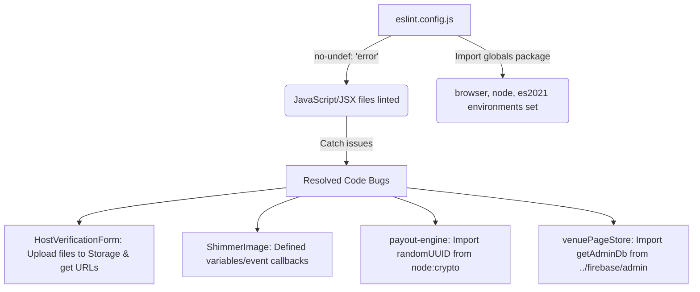

# Implementation Plan & Walkthrough - ESLint no-undef Enablement & Bug Resolutions

This document outlines the core problem with the disabled `no-undef` ESLint rule, details the four critical bugs it masked in JavaScript/JSX files, and explains the complete architecture of the solution and verification flow.

---

## 1. The Core Problem (Disabled `no-undef`)

In `eslint.config.js`, the ESLint rule `no-undef` was set to `'off'` for all JavaScript and JSX files (`**/*.{js,jsx}`). 

### Why it was disabled
ESLint's `no-undef` rule ensures all referenced variables are explicitly declared. Without configuring environment globals (such as `console`, `process`, or `window`), enabling the rule throws hundreds of false positives because ESLint does not know these exist natively. Rather than importing and configuring a `globals` registry, developers chose to turn the rule off entirely.

### The Impact
By turning off `no-undef`, several critical bugs where variables were misspelled, unimported, or completely undefined went completely unnoticed by compile/build checks, resulting in runtime crashes for users.

---

## 2. Masked Bugs & Analysis

### Bug A: Host Verification Form Silent Crash
* **File**: [HostVerificationForm.jsx](file:///c:/internship/thec1rcle/apps/partner-dashboard/components/HostVerificationForm.jsx)
* **The Problem**: In `handleSubmit`, the payload sent to `/api/auth/host-verification` referenced variables `idUrl` and `instaUrl` which were never declared or defined in the component. The user's uploaded files (`idDocument` and `instaScreenshot`) were collected but never uploaded to storage.
* **The Impact**: Submitting the form triggered a runtime `ReferenceError: idUrl is not defined` in the browser console, silently preventing users from completing verification.

### Bug B: ShimmerImage Component Failures
* **File**: [ShimmerImage.jsx](file:///c:/internship/thec1rcle/apps/partner-dashboard/components/ShimmerImage.jsx)
* **The Problem**: An incomplete refactoring of the custom Next.js image component left undefined references to `isPlaceholder`, `defaultSizes`, and the `handleLoad` event handler.
* **The Impact**: Displaying images using this component would trigger runtime crashes.

### Bug C: Unimported Payout Engine Identifier
* **File**: [payout-engine.js](file:///c:/internship/thec1rcle/packages/core/payout-engine.js)
* **The Problem**: The payout engine calls `randomUUID()` to generate unique transaction and request IDs but forgot to import it from Node's native `crypto` module.
* **The Impact**: Settling events or executing payouts failed at runtime on the server due to `ReferenceError: randomUUID is not defined`.

### Bug D: Unimported Database Helper in Venue Page Store
* **File**: [venuePageStore.js](file:///c:/internship/thec1rcle/apps/partner-dashboard/lib/server/venuePageStore.js)
* **The Problem**: The function `initializeDefaultFacilities` directly accesses Firestore using `getAdminDb()`, but `getAdminDb` was never imported.
* **The Impact**: Initializing default facilities for a venue threw an error during database operations.

---

## 3. The Solution & Complete Flow

We resolved this by properly configuring ESLint scopes and resolving each individual code defect.



### Step 1: Correct ESLint Configuration
We updated [eslint.config.js](file:///c:/internship/thec1rcle/eslint.config.js) to:
1. Enable `'no-undef': 'error'` for JavaScript and JSX files.
2. Import the `globals` package and merge `globals.browser`, `globals.node`, and `globals.es2021` to whitelist standard native variables.
3. Keep `'no-undef': 'off'` for TypeScript files (`**/*.{ts,tsx}`) because the TypeScript Compiler (`tsc`) handles identifier checks natively and ESLint checks on types are redundant.

### Step 2: Code Fixes
* **Host Verification**: Implemented standard Firebase Storage uploads in `HostVerificationForm.jsx`'s `handleSubmit` to upload files to the `host-verifications/` directory, resolve the download URLs via `getDownloadURL`, and send the resulting string URLs to the backend.
* **Shimmer Image**: Defined `isPlaceholder`, `defaultSizes`, and the `handleLoad` callback inside the component scope matching the shared `packages/ui` implementation.
* **Payout Engine**: Added `import { randomUUID } from 'node:crypto';` at the top of the file.
* **Venue Page Store**: Added `import { getAdminDb } from '../firebase/admin';` at the top of the file.

---

## 4. Verification Flow

1. **Local Lint Check**: Run ESLint on the modified scopes to verify no `no-undef` errors remain:
   ```bash
   npx eslint packages/core apps/partner-dashboard
   ```
2. **Project-wide Validation**: Run the monorepo-wide check:
   ```bash
   npm run lint
   ```
   All checks pass with **0 errors**.
