# Fault Tolerance Restoration in PublicDiscoveryService

This document explains the evolution of fault tolerance handling in [public-discovery-service.ts](file:///c:/internship/thec1rcle/packages/core/src/domain/services/public-discovery-service.ts), detailing what the initial bug was, what happened during the previous refactoring, how it was fixed, and the resulting execution flow.

---

## 1. Evolution of the Bug

### Phase 1: The Initial State (Silent Catching)
* **Code Pattern**: Queries in `Promise.all` had inline `.catch(() => null)` or `.catch(() => [])` blocks.
* **The Problem**: While fault tolerant, errors were silently swallowed. If a database index was missing or a query parameter was invalid, developers received no logs or warnings. Furthermore, returning `null` for array queries caused downstream crashes when calling `.filter()` or `.map()`.

### Phase 2: The Middle State (Over-Correction / Fault Tolerance Loss)
* **Code Pattern**: In commit `a9cae233`, `.catch(...)` blocks were stripped and replaced with `try { ... } catch (error) { console.error(...); throw error; }`.
* **The Bug**: `Promise.all` fast-fails on the first rejected promise. If an optional sub-resource query failed (e.g., `PROFILE_POSTS`, `PROFILE_HIGHLIGHTS`, `VENUE_MENU`, or spotlight settings), the entire request threw an exception, causing full HTTP 500 crashes for host/venue profiles and featured events.

### Phase 3: The Current Fix (Tiered Fault Tolerance with Warnings)
* **Code Pattern**: Critical primary reads remain strict (or return 404), while optional secondary reads catch errors, log explicit `console.warn` context, and return type-safe defaults (`[]` for arrays, `null` for optional objects).

---

## 2. Execution Flow Comparison

```mermaid
flowchart TD
    subgraph Phase2["Phase 2: Rigid Flow (Broken Fault Tolerance)"]
        A1[Incoming Profile Request] --> B1["Promise.all([Primary Doc, Highlights, Stats, Events])"]
        B1 -->|Highlights query fails| C1[Promise.all Rejects Immediately]
        C1 --> D1["Catch block rethrows error (throw error)"]
        D1 --> E1[HTTP 500 Page Crash for User]
    end

    subgraph Phase3["Phase 3: Restored Tiered Flow (Current Fix)"]
        A2[Incoming Profile Request] --> B2["Promise.all([Primary Doc, Highlights, Stats, Events])"]
        B2 -->|Highlights query fails| C2["Highlights catch handler logs console.warn + returns null"]
        B2 -->|Primary & other queries succeed| D2[Promise.all Resolves Successfully]
        C2 --> D2
        D2 --> E2[Render Profile Page with Primary Info + Fallbacks]
    end
```

---

## 3. Proposed Changes

### Core Domain Services

#### [MODIFY] [public-discovery-service.ts](file:///c:/internship/thec1rcle/packages/core/src/domain/services/public-discovery-service.ts)

* **`listFeaturedEvents`**: Caught `platform_settings/spotlights` fetch errors, logged `console.warn`, set `settings = null`, and fell back to heat-ordered events instead of failing the request.
* **`getHostPublicProfile`**: Added warning fallback handlers for optional sub-queries (`PROFILE_POSTS` -> `null`, `PROFILE_HIGHLIGHTS` -> `null`, `PROFILE_STATS` -> `null`, `events.queryList` -> `[]`).
* **`getVenuePublicProfile`**: Added warning fallback handlers for optional sub-queries (`PROFILE_HIGHLIGHTS` -> `null`, `PROFILE_STATS` -> `null`, `VENUE_MENU` -> `null`, `events.queryList` -> `[]`, `venues.queryList` -> `[]`).

---

## 4. Verification Plan

### Manual Verification
1. Verify that fetching a Host profile with invalid/missing highlight or post sub-documents still successfully renders the Host profile and upcoming events.
2. Verify that `console.warn` context appears in server logs when optional sub-queries fail.
