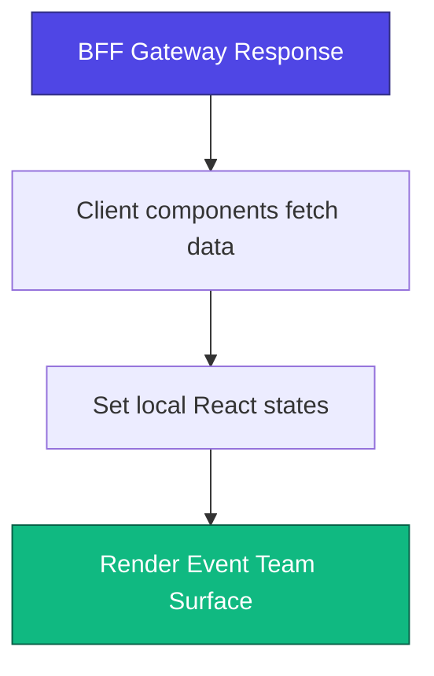
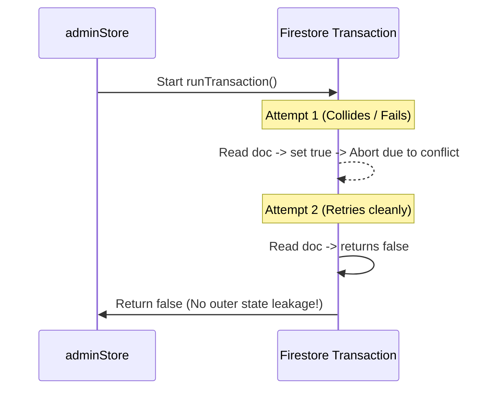
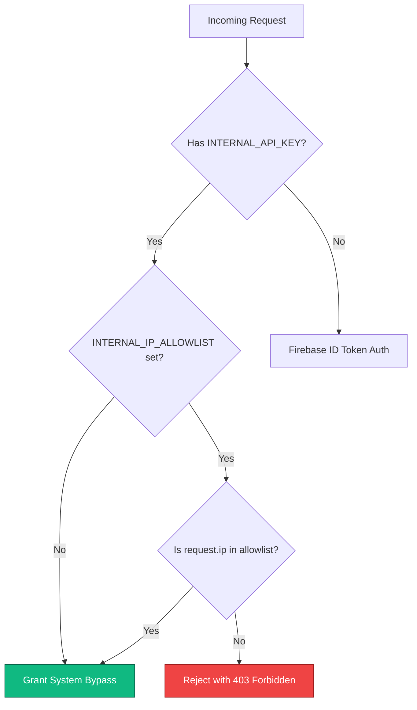

# Bug Fix Implementation Plan & Summary

This document outlines the bugs addressed and fixed during this paired-programming session, detailing what the issues were, how they were resolved, and the resulting request/data execution flows.

---

## 1. Production Console Log Cleanup (PII Exposure Risk)

### What was the bug?
In [EventTeamClient.tsx](file:///c:/internship/thec1rcle/apps/partner-dashboard/components/event-detail/EventTeamClient.tsx), five `console.log` statements were printing raw API responses (containing staff list emails, promoter names, promoter links, and ticket orders) directly to the browser's developer console. This created a potential PII data leak in production.

### How it was fixed:
Removed the 5 debug logging statements under the `loadAllData` function:
* Removed `console.log('Staff', staffList);`
* Removed `console.log('pdata', pData);`
* Removed `console.log('allConns', allConns);`
* Removed `console.log('linksList', linksList);`
* Removed `console.log('ordersList', ordersList);`

### Execution Flow:

*(No logs are generated in the client console).*

---

## 2. Race Condition in Transaction Retry (False Duplicate Detection)

### What was the bug?
In [adminStore.js](file:///c:/internship/thec1rcle/apps/admin-console/lib/server/adminStore.js#L886-L910), the idempotency verification fallback used a Firestore transaction. The mutable variable `let duplicate = false` was scoped outside the transaction callback:
* If write contention occurred, Firestore would retry the transaction callback.
* If a previous attempt set `duplicate = true` and then failed to commit, the retry attempt would start with `duplicate` already set to `true`, even if the contention cleared and no duplicate existed. This led to false duplicate detections.

### How it was fixed:
We refactored the transaction callback to return a boolean result directly, avoiding the use of mutated outer variables. The outer variable `duplicate` is now directly assigned the resolved value of `await db.runTransaction(...)`:
```javascript
    let duplicate = false;
    try {
      duplicate = await db.runTransaction(async (tx) => {
        const doc = await tx.get(docRef);
        if (doc.exists) {
          const ageMs = Date.now() - (doc.data().createdAt?.toMillis?.() || 0);
          if (ageMs < IDEMPOTENCY_TTL_SEC * 1000) {
            return true;
          }
        }
        tx.set(docRef, { ... });
        return false;
      });
    } catch (error) { ... }
```

### Execution Flow:


---

## 3. Internal API Key Auth Bypass (Missing IP Allowlisting)

### What was the bug?
In [firebase.ts](file:///c:/internship/thec1rcle/apps/api-gateway/src/plugins/firebase.ts#L262-L281), the API Gateway authenticated requests containing the `INTERNAL_API_KEY` token with full `isSystem: true` privileges. However, there was no source IP verification. If this key leaked, any attacker on the public internet could bypass authorization checks.

### How it was fixed:
1. **Added IP Validation:** We modified the Fastify request authentication hook to check `request.ip` against the `INTERNAL_IP_ALLOWLIST` environment variable before granting system access. If the IP is unauthorized, the request is immediately rejected with a `403 Forbidden` response.
2. **Hardened Configuration Schema:** Registered the environment variable in the Zod config schema in [config/index.ts](file:///c:/internship/thec1rcle/apps/api-gateway/src/config/index.ts).
3. **Set Up Local Defaults:** Added loopback IPs (`127.0.0.1,::1`) to [.env.development](file:///c:/internship/thec1rcle/apps/api-gateway/.env.development) and [.env.example](file:///c:/internship/thec1rcle/apps/api-gateway/.env.example) to verify local development and tests run smoothly.

### Request Flow:


---

> [!TIP]
> **Production Recommendation:** Remember to set `INTERNAL_IP_ALLOWLIST` in your production hosting panel with your backend BFF server's actual private IP to activate this safety lock.
