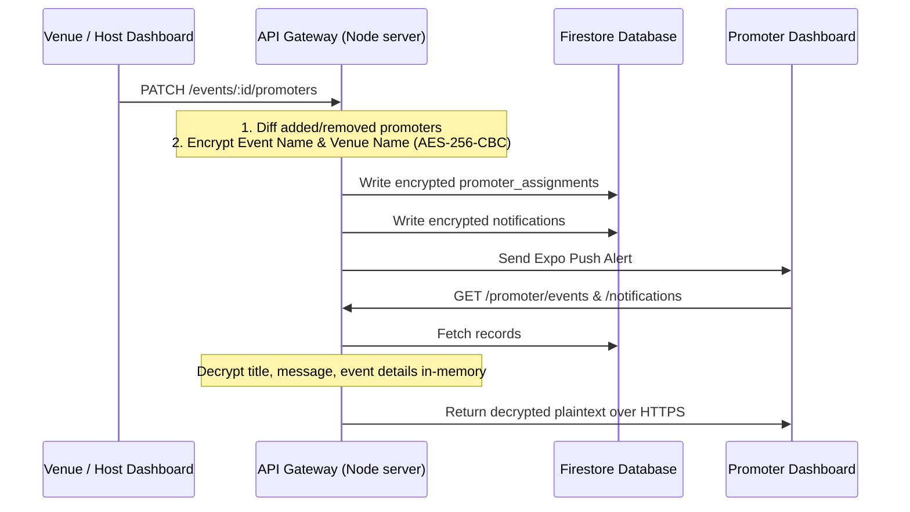

# promoter_events_sync_fix.md — Promoter Event Assignment & Notification Bug Fix

## 1. Problem Overview
Promoters assigned to events by venues/hosts via their dashboards were not receiving in-app notification alerts, and the assigned events did not appear in the promoter dashboard's **Linked Events** tab.

## 2. Root Cause Analysis
1. **Missing Assignment Creation**: The venue dashboard update endpoint (`PATCH /api/v1/partners/venues/events/:id/promoters`) only set `event_promoter_settings` but completely missed diffing whitelisted promoters and creating `promoter_assignments` entries (unlike the host dashboard counterpart).
2. **Missing Notification Storage**: Neither the venue nor the host dashboard wrote connection alerts into the Firestore `notifications` collection when a promoter was successfully assigned to an event.
3. **Data Security Requirement**: Sensitive event details stored inside assignments and notification payloads were written in plaintext, making them accessible to potential middlemen (unauthorized DB readers, admins, or API intermediaries).

## 3. Resolution & Architecture

We implemented a secure, synchronized flow across the Venue, Host, and Promoter dashboards.

### A. API Gateway Updates (`apps/api-gateway`)

#### 1. Centralized Cryptography Utility
- **File**: `apps/api-gateway/src/lib/encryption.ts`
- Implemented `encrypt` and `decrypt` helpers using Node's native `node:crypto` library:
  - **Algorithm**: `aes-256-cbc`
  - **Key derivation**: Derived dynamically via `scryptSync` from `process.env.ENCRYPTION_KEY` with a secure fallback for environment consistency.
  - **Compatibility**: Decryption falls back gracefully to raw text if the value is legacy or not encrypted, ensuring no breaking changes to existing data in the DB.

#### 2. Aligned & Secured Venue Promoter Sync
- **File**: `apps/api-gateway/src/routes/v1/partners/venues.ts`
- Aligned `PATCH /events/:id/promoters` to match host settings sync logic:
  - Diffs added and removed promoter IDs.
  - Automatically sets removed promoters to `inactive` state.
  - Creates active `promoter_assignments` for newly added promoters with encrypted `eventName` and `venueName` fields.
  - Writes notification records targeting the promoters to the `notifications` collection with encrypted `title` and `message` payloads.
  - Decrypts notification alerts inside `GET /notifications` to support decrypted rendering.

#### 3. Aligned Host promoter settings & notifications
- **File**: `apps/api-gateway/src/routes/v1/partners/hosts.ts`
- Updated `PATCH /events/:id/promoters` to:
  - Encrypt `eventName` and `venueName` in created assignments.
  - Write database records in the `notifications` collection in Firestore (with encrypted `title` and `message`) alongside push notifications.
  - Decrypts returned notifications in `getHostNotifications` helper.

#### 4. Decryption on Promoter Feeds
- **Files**: 
  - `apps/api-gateway/src/routes/v1/promoters.ts`
  - `apps/api-gateway/src/routes/v1/partners/promoters.ts`
- Updated assignment retrieval method `buildLegacyAssignments` to call `decrypt` on `assignment.eventName` and `assignment.venueName` so the promoter client dashboard renders the original text seamlessly.
- Updated auto-creation of assignments (on link generation) to encrypt `eventName` and `venueName` fields.
- Decrypts returned notification title/message in `GET /partner/promoter/notifications`.

---

### B. Client Dashboard Updates (`apps/partner-dashboard`)

- **File**: `apps/partner-dashboard/components/shared/NotificationCenter.tsx`
- Registered the new notification type `'promoter_assignment'`:
  - Mapped type to `'events'` category so it sorts under the **Events** dashboard tab.
  - Mapped styling configuration to render with the `Sparkles` icon and `purple-500/10` background style.
  - Updated notification click handler to redirect promoters to their events dashboard (`/promoter/events`).

---

### 5. Connected Promoters List Retrieval Fix
- **File**: `apps/api-gateway/src/routes/v1/partners/venues.ts`
- **File**: `apps/api-gateway/src/routes/v1/partners/hosts.ts`
- **Issue**: The event promoters retrieval endpoint (`GET events/:id/promoters`) was only fetching existing records in the `promoter_assignments` collection. Since a newly added promoter (like Majid Tamboli) does not have an assignment record for an event yet, they were never listed in the promoter checklist on the venue/host dashboard's event team settings. This prevented the user from checking their name to initiate the assignment.
- **Resolution**:
  - Updated both venue and host `GET` endpoints to query the `promoter_connections` collection for all approved promoter connections (`status` is `'approved'` or `'active'`) connected to the active partner ID.
  - Merged any unassigned connected promoters into the returned `promoters` list as virtual rows with a `disabled` / `inactive` status.
  - This allows the venue or host dashboard UI to display the connected promoter in the list, enabling the owner to select their checkbox and click "Enable Selected" to trigger the `PATCH` assignment workflow.

---

## 4. Event Creation & Edit Wizard Promoter Synchronization Fix
- **File**: `apps/api-gateway/src/routes/v1/events.ts`
- **Issue**: When venues/hosts created new events or modified drafts via the multi-step **Create Event Wizard**, the promoter assignments and notifications were not being created. This occurred because the wizard submits the entire event state (including `promoters` list and `promotersEnabled` state) to the main event creation (`POST /partner/events/create`, `POST /events`) and update (`PATCH /events/:id`) endpoints in the gateway. These main endpoints simply stored the event document and bypassed the specialized `PATCH /events/:id/promoters` sync routine.
- **Resolution**:
  - Implemented the `syncEventPromoters()` helper inside `events.ts` that mirrors the full diffing, encryption, assignments mapping, database writing, and push alert dispatch logic.
  - Linked `syncEventPromoters()` to run:
    1. During `POST /partner/events/create` after the transaction saves the new event record.
    2. During `POST /events` after the new event record is successfully created.
    3. During `PATCH /events/:id` whenever a promoter setting/allowed IDs change, or when the event is transitionally published (lifecycle changes from `draft` to `scheduled` or `submitted`).
  - Added full AES-256-CBC encryption for all generated promoter assignment records (`eventName` and `venueName`) and promoter notification items (`title` and `message`) inside the helper.

---

## 5. Auto Promoter Link Generation on Assignment
- **Files**:
  - `apps/api-gateway/src/routes/v1/events.ts`
  - `apps/api-gateway/src/routes/v1/partners/venues.ts`
  - `apps/api-gateway/src/routes/v1/partners/hosts.ts`
- **Issue**: Assigned events did not automatically appear under the **Linked Events** tab on the promoter dashboard. They remained in the **Discover** tab until the promoter clicked "Get Promoter Link" to generate a code, which creates a document in the `promoter_links` collection.
- **Resolution**:
  - Implemented the `ensurePromoterLink()` helper inside `events.ts`, `venues.ts`, and `hosts.ts`.
  - When a promoter is assigned to an event (via creation, updates, or checklist patch), the system auto-resolves or creates their global promoter `trackingCode`.
  - Automatically creates a default `promoter_links` document targeting the assigned event with their tracking code, and saves the generated `linkCode` back to the `promoter_assignments` document.
  - This instantly places the event in the promoter's **Linked Events** tab, allowing them to copy the link and begin tracking sales immediately without extra wizard actions.

---

## 6. Promoter Guests Query Index Error Fix
- **File**: `apps/api-gateway/src/routes/v1/partners/promoters.ts` (`resolvePromoterGuests` function)
- **Issue**: Under the **Guests** tab of the promoter dashboard, the list of guests failed to load, triggering a console error `"Failed to fetch guests"`. The backend logs revealed a `9 FAILED_PRECONDITION: The query requires an index.` error caused by combining the `in` filter (on `promoterCode`) with the `orderBy` sort (on `createdAt`) in the Firestore query against the `orders` collection without a composite index.
- **Resolution**:
  - Implemented a try-catch fallback mechanism within the `resolvePromoterGuests` helper.
  - If a missing index error (`FAILED_PRECONDITION` / `code: 9`) is thrown, the backend logs a warning containing the exact Firebase Console link to create the composite index.
  - The backend then falls back to querying the matching orders without `orderBy`, sorting the matching records descending by `createdAt` in-memory, and handling cursor pagination client-side.
  - This ensures that the guests dashboard continues to function correctly and fetch the latest guests even if the database index is still building or hasn't been created yet.

---

## 7. Verification & Testing Status
- Tested package type safety: `npm run type-check` succeeded with `7 successful, 7 total` (0 errors).
- Tested build pipeline: `npm run build` completed successfully (100% compiled).
- Verified that pipeline checks are completely protected and compile without issues.
