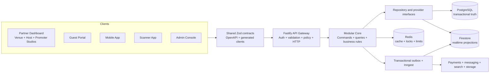

# THE C1RCLE Master Launch Implementation Plan

## Purpose

This is the detailed execution plan for moving THE C1RCLE from the current pre-launch repository to the dream architecture and a production launch.

It covers:

- API Gateway and Core business brain
- Shared contracts and generated API clients
- Partner Dashboard with Venue, Host and Promoter Studios
- Complete Guest Portal restructuring
- Mobile App and Scanner App
- Admin Console
- Authentication and authorization
- Events, checkout, payments, tickets, QR, refunds and door operations
- Promoters, commissions, finance and payouts
- Social, campaigns, notifications, search and analytics
- Firestore, PostgreSQL, Redis, storage, providers and background jobs
- API performance and cloud-cost control
- Legacy code, dead code, old routes and obsolete data
- Testing, migration, deployment, rollback and launch

The platform has not publicly launched and current data is test data. This gives us freedom to build a clean final system. It does not justify deleting working behavior before its replacement is proven.

## The destination



The rules are:

1. Clients render data and collect input.
2. Fastify is the only business API authority.
3. Web BFF routes, where retained, are transport-only.
4. Core owns business decisions and state transitions.
5. Repositories own database details.
6. Provider adapters own external SDK details.
7. PostgreSQL owns transactional commerce and finance at the dream state.
8. Firestore owns intentional realtime projections and social/realtime data.
9. Redis improves speed and concurrency but is never durable business truth.
10. One canonical write produces versioned events that update every client.

## How to use this plan

Each stage is deliberately smaller than a large product milestone. A stage can contain several focused pull requests, but it must have one clear outcome and one evidence gate.

Every stage records:

- Backend and data work
- Frontend/client work
- Legacy-code treatment
- Performance and cost treatment
- Tests and acceptance evidence
- Rollback

Do not move to a dependent stage when its entry conditions are not met. Independent UI, contract and test-harness work may run in parallel when file ownership is clear.

---

# Program A: Safety, facts and operating rules

## Stage 00: Confirm the authoritative checkout

### Backend and repository work

- Record `pwd`, branch, SHA and worktree list.
- Record all dirty and untracked changes without claiming ownership of them.
- Identify which checkout builds each deployed surface.
- Record Node, npm, Java, Expo, Firebase CLI and provider CLI versions.
- Create a release metadata format containing SHA, build number and environment.

### Frontend and client work

- Record the source/runtime checkout for Partner, Guest, Mobile, Scanner and Admin.
- Record current app versions, bundle identifiers and configured API origins.

### Legacy treatment

- No deletions.
- Mark duplicate checkout folders and backup copies as outside the authoritative build unless proven otherwise.

### Exit gate

- One signed-off source-of-truth checkout and branch map exists.

## Stage 01: Establish change and architecture guardrails

### Backend work

- Document forbidden dependencies: routes cannot access databases; domain code cannot import Fastify/Firebase/provider SDKs.
- Add lightweight architecture tests for new violations.
- Define code ownership by domain.
- Require compatibility and rollback notes for API/data changes.

### Frontend work

- Forbid direct Firebase Admin or business Firestore access in web applications.
- Forbid client-authoritative price, payment, permission and ticket decisions.
- Define the allowed thin-BFF use cases: cookies, CSRF, SSR, signed revalidation and file streaming.

### Legacy treatment

- Freeze new features in legacy route/store layers except critical fixes.
- New work starts in target modules or explicit compatibility adapters.

### Exit gate

- Guardrails fail on a small intentionally invalid fixture and pass on approved boundaries.

## Stage 02: Back up all test environments

### Data and infrastructure work

- Export Firestore with project ID and timestamp.
- Export Firebase Auth test accounts.
- Copy or inventory Storage objects.
- Export provider test objects where supported.
- Record Redis key families without treating Redis as backup-worthy truth.
- Verify restore into an isolated test project.

### Legacy treatment

- Nothing is removed or reset before restore proof.

### Exit gate

- Backup location, checksum, retention, access control, restore command and restore result are documented.

## Stage 03: Capture the current behavioral baseline

### Backend work

- Run focused auth, event, checkout, payment, ticket, refund, scan and finance tests.
- Record current route responses and error shapes.
- Record current webhook and job handlers.
- Capture known state vocabulary and money-field aliases.

### Frontend work

- Record critical Partner, Guest, Mobile, Scanner and Admin journeys.
- Capture screenshots/video of current staging behavior where available.
- Record fake, disabled, partial and broken UI honestly.

### Known baseline issue

- Freeze/inject the test clock for Venue Studio tests instead of using calendar dates that become “past.”

### Exit gate

- Baseline failures are separated from new regressions.

## Stage 04: Create deterministic fixtures

### Backend/data work

- Create seed organizations for Host, Venue, Promoter and combined organizations.
- Create owner, admin, event manager, finance, marketing, promoter, door, viewer and platform-admin users.
- Seed draft/published/cancelled events and every relevant order/payment/ticket/refund/payout state.
- Use deterministic IDs, fixed clock and test-only provider references.

### Frontend work

- Give every client a documented login and expected journey for each role.

### Cost control

- Seed the smallest dataset that proves behavior; create separate load fixtures rather than bloating normal development databases.

### Exit gate

- Fixtures are repeatable, identifiable and safely removable.

## Stage 05: Baseline performance and cloud cost

### Backend/infrastructure work

- Measure request count, latency, response size, Firestore reads/writes, Redis operations and job count per critical journey.
- Capture Cloud Run CPU/memory/concurrency/instance settings.
- Capture Vercel function invocations, bandwidth and image optimization usage.
- Capture Firebase reads/writes/storage/egress, Redis memory and provider costs.
- Add environment and service cost labels.
- Create budget alerts for staging and production.

### Frontend work

- Measure route JavaScript size, image bytes, request waterfalls, duplicate calls and Core Web Vitals.
- Measure Mobile startup, API call count and image/cache usage.

### Exit gate

- We have a cost-per-journey baseline for discovery, event detail, checkout, wallet, dashboard overview and scan.

---

# Program B: Shared contracts and platform foundations

## Stage 06: Create `packages/contracts`

### Backend work

- Add Zod schemas for IDs, timestamps, money, currency, pagination, sorting, filters, actor context, request IDs, idempotency and resource versions.
- Add a standard success/error envelope.
- Preserve compatibility helpers for current V1 clients.

### Frontend/client work

- All clients import inferred types from the package rather than copying request/response interfaces.
- Keep existing adapters while migrating one contract at a time.

### Legacy treatment

- Mark duplicated interfaces as compatibility types.
- Do not delete a duplicate until every import is migrated.

### Exit gate

- Gateway plus one route in every client compiles against shared contracts.

## Stage 07: Add OpenAPI and generated client delivery

### Backend work

- Generate OpenAPI from the same runtime schemas used by Fastify.
- Add schema-version and API-version metadata.
- Publish generated client packages for browser and native consumers.

### Frontend work

- Wrap generated clients with one browser transport, one server transport and one native transport.
- Centralize auth headers, request IDs, timeout, retry and error parsing.

### Optimization and cost

- Prevent duplicate wrappers from making double requests.
- Add request cancellation and deduplication.

### Exit gate

- Contract snapshot and OpenAPI parity tests pass.

## Stage 08: Standardize errors, retries and timeouts

### Backend work

- Define stable error codes for validation, auth, permission, not found, conflict, inventory, payment, ticket, rate limit and provider failure.
- Add server deadlines and provider timeouts.
- Retry only safe operations with bounded exponential backoff.

### Frontend work

- Map errors into actionable UI states.
- Do not retry validation, permission or irreversible commands automatically.
- Show request ID in support-friendly error details.

### Cost control

- Prevent retry storms with jitter, retry budgets and circuit-breaker behavior.

### Exit gate

- Every client renders the same canonical failure correctly.

## Stage 09: Standardize command safety

### Backend work

- Add durable idempotency records for critical commands.
- Add expected-version/optimistic concurrency support.
- Define transaction, lock and audit requirements per command.
- Inject clock and ID generator.

### Frontend work

- Generate one idempotency key per user intent, not per network retry.
- Disable duplicate submissions while preserving safe retry.

### Exit gate

- Retry and concurrency tests show one business result.

## Stage 10: Define canonical state and compatibility maps

### Backend/data work

- Finalize Event, Order, Payment, Ticket, Transfer, Refund and Payout state machines.
- Create explicit translators for current legacy values.
- Preserve raw legacy state during migration for diagnosis.

### Frontend work

- UI uses shared state enums and presentation maps.
- Remove independent string comparisons only after adapters exist.

### Exit gate

- Every observed current state maps to one canonical meaning or an explicit UNKNOWN/attention state.

---

# Program C: Identity, organizations and permission authority

## Stage 11: Build the canonical identity service

### Backend work

- Verify Firebase ID tokens and required revocation state.
- Resolve one platform User per Firebase identity.
- Handle phone, Apple, Google and account linking.
- Handle disabled, deleted and banned users.
- Add `/v2/session/sync`, `/v2/session` and logout/revoke behavior.

### Frontend work

- Partner, Guest, Mobile, Scanner and Admin share the session contract.
- Auth is complete only after backend session sync.

### Legacy treatment

- Existing auth routes proxy/translate to the canonical service during migration.

### Exit gate

- Identity collision, linking, revocation and cross-client session tests pass.

## Stage 12: Rebuild Guest authentication and account upgrade

### Backend work

- Define anonymous browsing, checkout-required auth, guest profile and account-upgrade rules.
- Link historical test orders/tickets safely by verified identity, never email guessing alone.

### Guest Portal work

- Consolidate login, signup, OTP, callback and onboarding into one feature flow.
- Preserve safe return URLs and pending checkout intent.
- Remove duplicate auth page implementations after redirect and test proof.

### Mobile work

- Align onboarding and account-linking behavior with Guest Web.

### Exit gate

- A guest can browse, authenticate during checkout and keep the same order/wallet identity.

## Stage 13: Create organization and membership authority

### Backend work

- Implement Organization, Membership, Role, Permission and resource-scope repositories/services.
- Support Host, Venue, Promoter and combined capabilities.
- Implement invitations, acceptance, suspension and revocation.

### Partner frontend work

- Add active-organization selector and membership-aware bootstrap.

### Admin work

- Add organization verification/support views using the same services.

### Exit gate

- No command trusts a client-provided organization without membership and resource-scope checks.

## Stage 14: Implement the permission policy engine

### Backend work

- Define named permissions.
- Define default-deny evaluation.
- Add organization, venue, event, order, ticket and assignment scope.
- Invalidate caches/sessions when membership changes.

### Frontend work

- Generate navigation and action visibility from permissions.
- Permission-denied UI remains distinct from not-found where security allows.

### Optimization and cost

- Cache bounded permission context in Redis with versioned invalidation.
- Never let Redis become the permission authority.

### Exit gate

- Complete allow/deny and IDOR matrix passes.

## Stage 15: Harden scanner and admin sessions

### Backend work

- Add short-lived scanner sessions scoped to device, venue, event and door.
- Add platform-admin session/step-up requirements.
- Require reasons for sensitive overrides and exports.

### Scanner/Admin work

- Scanner stores only required session material securely.
- Admin surfaces show audit context and expiry.

### Exit gate

- Normal partner tokens cannot perform scanner/admin operations and vice versa.

---

# Program D: Core and gateway restructuring

## Stage 16: Create repository and provider ports

### Backend work

- Define repository interfaces for identity, organization, venue, event, inventory, order, payment, ticket, refund, check-in, ledger and payout.
- Define provider interfaces for Firebase Auth, payment, payout, email, SMS, push, search, storage and wallet passes.
- Add fake adapters for deterministic tests.

### Legacy treatment

- Existing Core engines sit behind compatibility adapters.
- No behavior is removed in this stage.

### Exit gate

- A domain/application service can run without importing Firebase/provider SDKs.

## Stage 17: Move configuration and infrastructure out of Core

### Backend work

- Move Firebase clients/repositories toward `packages/database` and `packages/auth`.
- Move provider SDK setup to adapter packages.
- Inject validated configuration, clock, IDs and telemetry.

### Legacy treatment

- Keep old Core export paths as deprecated forwarding exports during consumer migration.

### Exit gate

- No new domain module reads `process.env` or constructs provider clients.

## Stage 18: Add Core migration harnesses

### Backend work

- Add old-versus-new result comparison tools.
- Add strict transaction doubles.
- Add event/side-effect snapshots.
- Add shadow-read mismatch logging without exposing PII.

### Cost control

- Shadow comparisons are sampled/bounded in staging; they do not double every production read indefinitely.

### Exit gate

- One low-risk query proves the strangler migration pattern.

## Stage 19: Create a route-policy manifest

### Backend work

- Classify every gateway and app-local method as public, user, partner, scanner, admin, internal or provider webhook.
- Assign contract, permission, resource scope, rate limit, idempotency, audit, cache and owner.
- Resolve static-scan unknowns through focused review/tests.

### Legacy treatment

- Every legacy route receives KEEP, WRAP, REPLACE or REMOVE-AFTER-PROOF status.

### Exit gate

- No protected/financial route has UNKNOWN policy fields.

## Stage 20: Make gateway routes thin by architecture enforcement

### Backend work

- Convert direct database handlers to one application-service call per use case.
- Keep validation, identity, policy and HTTP mapping in the route.
- Add response validation to security/financial boundaries.
- Add an architecture check forbidding new route `.collection()` calls.

### Optimization

- Remove duplicate route lookups by passing resolved context into services.
- Use batch/multi-get repository queries where appropriate.

### Exit gate

- Migrated route files contain no direct database access or business calculations.

## Stage 21: Build transactional outbox and job ownership

### Backend/data work

- Define versioned domain-event schemas.
- Commit outbox event with canonical write.
- Process through idempotent workers.
- Add retry, dead-letter/attention state and replay tooling.
- Inventory and remove overlapping Firebase/Inngest schedules after proof.

### Cost control

- Batch projection and messaging work.
- Debounce repeated event/search updates.
- Avoid one expensive job per trivial field change.

### Exit gate

- Killing a worker after commit does not lose or duplicate the business result.

---

# Program E: Shared frontend foundations

## Stage 22: Consolidate design tokens and accessible primitives

### Frontend work

- Decide what belongs in `packages/ui`: tokens, typography, colors, spacing, icons and stable primitives.
- Keep product-specific components inside their applications.
- Add accessibility, keyboard, focus, reduced-motion and responsive behavior.

### Legacy treatment

- Do not merge superficially similar components until visual/behavior parity exists.
- Mark old components deprecated after all consumers move.

### Cost/performance

- Avoid a massive shared bundle; use tree-shakeable entry points.

### Exit gate

- Partner and Guest can consume primitives without importing each other.

## Stage 23: Build one frontend data-access pattern

### Frontend work

- Define query keys, stale times, invalidation, optimistic-update rules and error mapping.
- Use generated clients.
- Separate public server fetches, browser-auth fetches and native fetches.
- Add cancellation, deduplication and bounded retry.

### Optimization

- Prevent mount cascades and duplicate fetches.
- Prefetch only high-confidence next routes.
- Do not cache private/financial responses publicly.

### Exit gate

- A session change safely clears all identity-scoped caches.

## Stage 24: Build the Partner Dashboard shell

### Frontend work

- Implement organization/studio selection, navigation, search, notification shell and user controls.
- Add loading, empty, error, stale, denied and offline states.
- Add feature flags for Venue, Host and Promoter Studios.

### Backend work

- Provide one bootstrap query with only high-value shell information.

### Optimization

- Avoid one API call per navigation item or metric.
- Cache organization bootstrap privately with short TTL and versioned invalidation.

### Exit gate

- The shell has no direct Firebase/business API access and no fake actions.

## Stage 25: Guest Portal target structure

### Current facts to preserve

- The Guest Portal already has feature folders, a generated Guest V1 client, only two narrow app-local API routes, no detected production direct Admin/Firestore access and roughly 30 tests.
- Preserve its boundary tests, signed revalidation route, canonical API direction, SEO behavior and characterized checkout/wallet behavior.

### Target structure

```text
apps/guest-portal/
  app/                   route composition, metadata and layouts only
  features/
    auth/
    discovery/
    events/
    venues/
    checkout/
    orders/
    tickets/
    profile/
    social/
    notifications/
    seo/
  components/            Guest-specific compositions
  lib/api/               generated transport adapters only
  lib/auth/              cookie/session/browser boundaries
  tests/                 contracts, boundaries, rendering and E2E
```

### BFF decision

- Keep signed cache revalidation.
- Keep development email preview excluded from production; preferably move it into a development-only story/preview tool later.
- Do not add business APIs to Next.js.

### Exit gate

- Target folders and dependency rules are enforced before page-by-page migration.

## Stage 26: Guest route and SEO consolidation

### Guest frontend work

- Choose canonical event, venue, host, ticket, profile and auth URLs.
- Consolidate overlapping `/e`, `/event`, `/events` and vanity behavior through server redirects/resolution.
- Consolidate `/venue` and `/venues` aliases.
- Preserve canonical tags, metadata, structured data and historical inbound links.
- Keep redirect maps explicit and tested.

### Backend work

- Provide stable slug/handle resolution and minimal public projections.

### Legacy treatment

- Old pages become redirects or compatibility loaders first.
- Delete their UI implementations only after crawler, analytics and route tests prove parity.

### Cost/performance

- Resolve vanity URLs with cached indexed queries, not collection scans.
- Use CDN/Next caching and targeted signed revalidation.

### Exit gate

- One canonical URL exists per public resource with no SEO loss or redirect loops.

## Stage 27: Guest layout and feature-page migration

### Frontend work

- Rebuild page compositions on the feature architecture.
- Consolidate navbar, footer, event card, venue card, skeleton, empty and error states.
- Preserve the existing visual identity where desired while removing accidental duplication.
- Separate real product data from clearly labelled marketing/demo illustrations.

### Legacy treatment

- Move old page implementations to a temporary `legacy` quarantine only when needed for rollback.
- No new imports may enter quarantine.

### Optimization

- Server-render public SEO content.
- Hydrate only interactive islands.
- Lazy-load heavy carousels, maps, wallet and checkout SDKs.

### Exit gate

- Home, Explore, event, venue and host pages use canonical components/contracts.

## Stage 28: Mobile and Scanner client foundations

### Mobile work

- Align Expo SDK/toolchain with the approved stable version.
- Centralize generated API client, auth token, query cache, deep links, network state and Sentry release.
- Preserve native Razorpay/dev-client requirements.

### Scanner work

- Centralize scoped session, device identity, network state and scan API.

### Optimization

- Use image sizing, disk cache, list virtualization and request deduplication.
- Avoid polling when push/realtime/event-driven refresh suffices.

### Exit gate

- Physical debug/release clients connect to the correct staging gateway.

## Stage 29: Admin frontend migration foundation

### Backend work

- Create `/v2/admin` adapters to Core services.

### Admin work

- Move app-local database/business routes to generated gateway clients.
- Add reason/confirmation/audit context to sensitive operations.

### Legacy treatment

- Keep temporary proxies with route telemetry; forbid new Admin Firestore ownership.

### Exit gate

- One sensitive Admin workflow is fully gateway/Core-owned.

---

# Program F: Venues, events and public discovery

## Stage 30: Canonical venue model and projections

### Backend/data work

- Implement Venue, VenueLocation, profile, space, menu, policy and public projection services.
- Define private versus public fields.
- Add versioning, signed media upload and projection events.

### Frontend work

- Venue Studio manages private data.
- Guest and Mobile render the public projection.
- Admin reviews/moderates through Core.

### Optimization

- Cache public venue projections at CDN/Redis.
- Resize and optimize images at upload/delivery.

### Exit gate

- One Venue Studio change appears correctly in Guest and Mobile.

## Stage 31: Scheduling, calendar and slot requests

### Backend work

- Implement time-zone-aware schedules, conflicts, holds and slot-request state machine.
- Use optimistic version/transaction for acceptance.

### Partner work

- Venue calendar and Host request/response workflows.

### Exit gate

- Concurrent conflicting bookings cannot both succeed.

## Stage 32: Canonical event read path

### Backend work

- Implement bounded organization event lists, event detail, public event, preview and search projection queries.
- Add cursor pagination and indexed filters.

### Frontend work

- Partner list/detail/calendar.
- Guest discovery/event detail.
- Mobile discovery/event detail/map.
- Admin support view.

### Optimization

- No unbounded event collection reads.
- Public event cards use small projections.
- Cache keys include locale/city/filter/version only when needed.

### Exit gate

- Every client shows the same public event ID/version.

## Stage 33: Event draft editor foundation

### Backend work

- Create idempotent draft, patch and autosave commands with expected version.

### Partner work

- Shared editor shell for Venue/Host permissions.
- Sections for basics, schedule, media, policies and review.
- Draft recovery and conflict UI.

### Cost/performance

- Debounce autosave and patch changed sections instead of rewriting whole documents.

### Exit gate

- Retry and simultaneous-edit conflict behavior is clear and lossless.

## Stage 34: Event catalogs

### Backend work

- Add ticket tiers, sale windows, capacity, table packages, promo codes and limits.
- Validate capacity invariants and price snapshots.

### Frontend work

- Add focused catalog editors and previews.
- Reuse the exact public tier contract Guest/Mobile will receive.

### Exit gate

- Sold capacity cannot be reduced below sold quantity and invalid sale windows fail.

## Stage 35: Promoter assignment during event setup

### Backend work

- Add assignments, acceptance, referral links/codes and versioned commission terms.

### Frontend work

- Host assigns; Promoter Studio accepts and views scope/terms.

### Exit gate

- Historical orders retain the correct attribution/term version.

## Stage 36: Review, preview and publication

### Backend work

- Implement review/schedule/publish/pause/resume/cancel/archive transition services.
- Commit event, audit and outbox atomically.

### Frontend work

- Partner review checklist and public preview.
- Guest/Mobile preview never leaks as public discovery.

### Optimization

- Debounce projection/search updates; invalidate exact tags/cache keys.

### Exit gate

- One publish retry produces one public event and one logical projection update.

## Stage 37: Guest public discovery rebuild

### Guest work

- Rebuild home, Explore, city filters, featured sections, event cards and search on canonical projections.
- Preserve SEO, accessibility and honest empty/error states.

### Backend work

- Create ranked, paginated, cacheable discovery responses.
- Keep personalization separate from public cache keys.

### Cost optimization

- CDN-cache anonymous feeds.
- Redis-cache hot city/filter results.
- Precompute expensive ranking.
- Avoid per-card host/venue/guest N+1 reads.

### Exit gate

- Defined discovery latency/read/response budgets pass at staging load.

---

# Program G: Commerce, tickets and guest ownership

## Stage 38: Characterize existing commerce

### Backend work

- Freeze current reserve/initiate/verify/webhook/finalize behavior with tests.
- Record order/payment/ticket identifiers and all side effects.
- Test free, paid, failure, expiry, replay and concurrency.

### Client work

- Record Guest and Mobile checkout compatibility.

### Legacy treatment

- No commerce deletion or provider callback change.

### Exit gate

- Current behavior is reproducible without fabricated provider success.

## Stage 39: Canonical pricing quote

### Backend work

- Implement integer-minor-unit pricing, fee, tax, promo, surge and quantity policies.
- Return signed/versioned or server-resolvable quote with expiry.

### Guest/Mobile work

- Display only server quote totals.
- Clearly handle price changes and expiry.

### Optimization

- Cache stable catalog inputs, never final user-specific authority beyond safe bounds.

### Exit gate

- Web and Mobile show identical totals for identical input.

## Stage 40: Canonical inventory and holds

### Backend/data work

- Implement durable holds, expiry and conversion.
- Use Redis lock plus database transaction/constraint.
- Add cleanup/reconciliation worker.

### Frontend work

- Honest availability and expiry countdown.
- No fake local availability fallback.

### Exit gate

- Last-ticket contention produces one winner and no negative inventory.

## Stage 41: Canonical orders and free checkout

### Backend work

- Implement Order aggregate, items and immutable totals.
- Finalize free orders idempotently through the same fulfillment boundary.

### Guest/Mobile/Partner/Admin work

- Guest/Mobile order confirmation and history.
- Partner/Admin scoped order views.

### Exit gate

- Free checkout issues the correct entitlements once.

## Stage 42: Payment attempts and canonical webhook

### Backend work

- Implement PaymentAttempt and immutable WebhookEvent.
- Select one provider webhook endpoint.
- Verify raw signature, provider IDs, amount and currency.
- Route client verification and webhook through one idempotent finalizer.

### Guest/Mobile work

- Browser/native provider UI only; client cannot mark paid.

### Cost/reliability

- No aggressive payment polling; use bounded status refresh plus webhook/realtime update.

### Exit gate

- Provider replay produces one payment/order/ticket/ledger result.

## Stage 43: Ticket issuance and wallet projection

### Backend work

- Issue one canonical entitlement per admission unit.
- Generate signed/versioned QR authority.
- Project wallets to Firestore/realtime clients.

### Guest/Mobile work

- Rebuild wallet/order/ticket pages on canonical contracts.
- Lazy-load pass/PDF generation.

### Partner/Admin work

- Show operational ticket state without exposing reusable secrets.

### Exit gate

- Web, Mobile, Partner and Admin agree on ticket count and state.

## Stage 44: Transfer, share and claim

### Backend work

- Implement hashed, expiring, single-use claims and atomic ownership transfer.
- Revoke old QR authority.

### Guest/Mobile work

- Unified send, accept, decline/cancel and failure states.

### Exit gate

- Ownership cannot exist in two wallets and old credentials fail.

## Stage 45: Refund workflow

### Backend work

- Implement eligibility, request, approval, provider submission, callback/reconciliation and reversal.
- Reverse ticket, inventory, order, payment, ledger, commission and balance consistently.

### Frontend work

- Guest/Mobile request/status where policy permits.
- Partner/Admin approval/status based on permissions.

### Exit gate

- Refund replay is safe and all surfaces reconcile.

---

# Program H: Guests, door operations and partner economics

## Stage 46: Guest profile and privacy model

### Backend work

- Define private/public profile fields, preferences, consent, blocks, deletion and retention.

### Guest/Mobile work

- Unify profile, settings, export and deletion journeys.

### Legacy treatment

- Remove duplicated profile APIs only after both clients migrate.

### Exit gate

- Field-level exposure and privacy tests pass.

## Stage 47: Guest lists and audience

### Backend work

- Implement lists, entries, invitations, RSVP and scoped audience queries.
- Audit exports and enforce page limits.

### Partner/Scanner work

- Guest management and minimum door lookup.

### Cost optimization

- Use indexed cursor queries and aggregate counters instead of loading full lists for metrics.

### Exit gate

- Large guest lists remain bounded and PII access is proven.

## Stage 48: Promoter attribution and commissions

### Backend work

- Store immutable attribution and commission-term snapshots on order/ledger facts.
- Handle refunds and disputes.

### Partner work

- Host performance and Promoter Studio sales/commission statements.

### Exit gate

- Promoter and finance totals reconcile to orders and ledger.

## Stage 49: Staff and door sessions

### Backend work

- Implement staff assignment, device binding, door session and revocation.

### Partner/Scanner work

- Staff management and scanner setup flows.

### Exit gate

- Removed staff immediately loses future door authority within the defined SLO.

## Stage 50: Atomic scanner/check-in service

### Backend work

- Validate signature/version, event scope, ticket state, ownership, transfer, refund, revocation and prior check-in.
- Create one CheckIn transactionally and idempotently.

### Scanner work

- Valid, duplicate, invalid, wrong-event, refunded, transferred and offline UX.

### Partner/Guest/Mobile work

- Live door counts and wallet checked-in projection.

### Optimization

- Keep hot door state bounded in Redis/Firestore, but confirm admission against canonical authority.

### Exit gate

- Two physical devices cannot double-admit one ticket.

## Stage 51: Offline scanning and manual override

### Backend work

- Define signed offline dataset, expiry, conflict resolution and replay.
- Require permission/reason/audit for override.

### Scanner work

- Network-loss queue, local duplicate cache, visible sync state and safe recovery.

### Exit gate

- Physical offline/reconnect scenarios pass without silent duplicate entry.

## Stage 52: Cover charge, walk-ins and tables at the door

### Backend work

- Converge cover wallets, walk-in orders, table admission and ledger behavior on canonical money/ticket/check-in rules.

### Partner/Scanner work

- Operational configuration, sale/admission and reconciliation views.

### Exit gate

- Walk-in money and admission reconcile like normal commerce.

---

# Program I: Finance, engagement and intelligence

## Stage 53: Immutable ledger

### Backend/data work

- Implement double-entry ledger with immutable references to order, payment, refund, commission and payout.
- Add reconciliation and exception queue.

### Partner/Admin work

- Read-only statements and exception investigation.

### Optimization

- Precompute balances from ledger events; do not rescan all transactions per request.

### Exit gate

- Provider/order/payment/refund/ledger totals reconcile exactly.

## Stage 54: Bank accounts and payout readiness

### Backend work

- Implement protected bank details, verification, KYC and change audit.
- Calculate available balance from ledger facts.

### Partner/Admin work

- Finance permission and step-up UX.

### Exit gate

- Payout remains disabled until all prerequisites are green.

## Stage 55: Payout lifecycle

### Backend work

- Reserve balance transactionally.
- Implement approval, provider submission, callback, failure and reconciliation.

### Frontend work

- Partner request/status and Admin controlled oversight.

### Exit gate

- Concurrent requests cannot overspend and every provider outcome reconciles.

## Stage 56: Notifications and preference authority

### Backend work

- Implement notification intent, user preferences, delivery attempts and provider adapters.

### Client work

- Partner/Guest/Mobile inbox, push/deep links and preference controls.

### Cost control

- Batch delivery, dedupe intents and enforce provider quotas.

### Exit gate

- One business trigger creates one logical user notification per policy.

## Stage 57: Campaigns and audience delivery

### Backend work

- Implement consent-aware segments, recipient estimate, cost estimate, schedule/send/cancel and delivery callbacks.

### Partner work

- Marketing composer, preview, confirmation, reporting and suppression visibility.

### Cost control

- Require explicit send confirmation above cost thresholds.
- Batch provider operations and cap retries.

### Exit gate

- No ineligible recipient is contacted and billed deliveries reconcile.

## Stage 58: Social, chat and moderation

### Backend work

- Keep realtime Firestore where useful while centralizing membership, entitlement, block, ban, report and moderation policy.

### Guest/Mobile/Admin work

- Consistent access and moderation outcomes.

### Cost optimization

- Paginate messages, bound listeners, detach background subscriptions and enforce retention.

### Exit gate

- Bans/blocks cannot be bypassed through legacy social routes.

## Stage 59: Search and discovery provider consolidation

### Backend work

- Select the active search provider per use case.
- Version index schemas and build replayable projectors.
- Remove duplicate provider writes after parity.

### Cost control

- Index only searchable public fields.
- Batch updates and remove unused duplicate indexes/providers.

### Exit gate

- Search results match canonical public visibility and one provider owns each index.

## Stage 60: Analytics metric registry and projections

### Backend/data work

- Define formula, source, dimensions, time zone, freshness and projection version for every metric.
- Build replayable event/venue/promoter/finance projections.

### Partner/Admin work

- Dashboards show freshness and link financial metrics to reconciled facts.

### Cost optimization

- Pre-aggregate metrics; never compute dashboards through repeated full collection scans.
- Use bounded time windows and cold-storage/retention policy for raw analytics events.

### Exit gate

- Dashboard totals match canonical facts within defined SLO.

---

# Program J: Transactional database migration

## Stage 61: Design PostgreSQL transactional schema

### Data work

- Model inventory, holds, orders, items, payment attempts, webhook events, refunds, tickets, transfers, check-ins, ledger, commissions, balance reservations and payouts.
- Add keys, unique constraints, foreign keys, checks and indexes.
- Define migration/version tooling and connection pooling.

### Cost control

- Start with a right-sized regional instance and measured storage/IO needs.
- Avoid one database connection per serverless request; use bounded pooling/connector strategy.

### Exit gate

- Schema review and transaction/concurrency tests pass.

## Stage 62: Build SQL repository adapters

### Backend work

- Implement repository contract suites against both current Firestore and SQL adapters.
- Add transaction and idempotency constraints.

### Exit gate

- Core behavior is storage-independent in tests.

## Stage 63: Backfill and shadow compare

### Data work

- Backfill from frozen export plus ordered changes.
- Store migration checkpoints/checksums.
- Compare counts, IDs, states and all money totals.

### Cost control

- Run bounded batches with rate limits; do not overwhelm Firestore or SQL.

### Exit gate

- Zero unexplained differences.

## Stage 64: Switch transactional authority by workflow

### Backend work

- Switch in order: holds/inventory, orders, payments/webhooks, tickets/transfers/check-ins, refunds, ledger/commissions/payouts.
- Continue Firestore compatibility projections for installed clients.

### Rollback

- Feature flags restore reads/adapters without reversing legitimate business state.

### Exit gate

- Each authority switch survives staging load, replay and reconciliation.

---

# Program K: API, frontend and cloud-cost optimization

## Stage 65: Set API service-level and query budgets

### Initial budgets

- Cached public/overview reads: p95 below 200 ms.
- Event detail: p95 below 300 ms.
- Analytics read: p95 below 400 ms.
- Ordinary non-provider command: p95 below 700 ms.
- Define route-specific response-size, Firestore-read, SQL-query and Redis-operation budgets.

### Backend work

- Instrument by route template, client, status and cache outcome.
- Reject unbounded page sizes.

### Exit gate

- Every launch-critical endpoint has a measurable budget and owner.

## Stage 66: Eliminate N+1 and over-fetching

### Backend work

- Use small resource projections and batch repository reads.
- Add cursor pagination and selective fields.
- Precompute dashboard summaries.
- Split large optional details into explicit endpoints.

### Frontend work

- Request only what the screen uses.
- Avoid refetching unchanged bootstrap/session data.

### Cost outcome

- Lower Firestore reads, SQL queries, payload egress and client parsing work.

### Exit gate

- Request traces contain no unexplained per-item database loop.

## Stage 67: Build intentional caching

### Public caching

- CDN/Next cache for public events, venues, discovery and SEO.
- Signed targeted revalidation from canonical event changes.

### Private caching

- Short-lived Redis caches for organization dashboard summaries and permission context.
- Private/no-store for tickets, finance, bank and sensitive profile data.

### Client caching

- React Query/native caches with domain-specific stale times and invalidation.

### Safety

- Cache keys include authority/version/scope.
- No cross-user or cross-organization leakage.

### Exit gate

- Cache hit rate improves without stale publication, permission or finance bugs.

## Stage 68: Optimize Cloud Run and Vercel

### Cloud Run

- Right-size CPU/memory after load results.
- Set tested concurrency and maximum instances.
- Choose minimum instances based on measured cold-start need, not guesswork.
- Keep gateway, SQL, Redis and Firebase regionally aligned where possible.
- Use request-scoped CPU and graceful shutdown/connection reuse.

### Vercel

- Prefer static/ISR public pages and direct gateway calls over unnecessary function hops.
- Keep only justified BFF/server actions.
- Control image optimization, bandwidth and function duration.

### Exit gate

- Cost forecast at expected traffic and peak load is approved.

## Stage 69: Optimize Firestore, Redis and SQL

### Firestore

- Use explicit public/read-model documents.
- Add required indexes, cursor queries, aggregate documents and listener limits.
- Apply retention/TTL where supported.

### Redis

- Define key prefix, TTL, maximum value size and invalidation owner.
- Monitor memory/eviction/hit rate.
- Do not cache low-reuse data.

### SQL

- Review slow queries, indexes, pool saturation and transaction duration.
- Archive/partition only when measured need exists.

### Exit gate

- No critical query is unbounded and storage cost alarms are configured.

## Stage 70: Optimize jobs, logs, media and providers

### Jobs

- Batch, debounce and deduplicate.
- Use retention for outbox/job history.

### Logs/telemetry

- Redact PII/secrets.
- Sample successful traces and retain errors/security/finance evidence appropriately.
- Avoid logging full provider payloads repeatedly.

### Media

- Resize, compress, use modern formats/CDN and lifecycle temporary uploads/exports.

### Providers

- Add quotas, cost thresholds and delivery reconciliation.

### Exit gate

- Cost dashboards attribute spending by service/environment and alert on abnormal unit cost.

## Stage 71: Frontend performance pass

### Web

- Route-level code splitting, interactive-island hydration, font/image optimization and bundle budgets.
- Avoid large client-only public pages.
- Measure LCP, INP and CLS on real staging devices.

### Mobile/Scanner

- Virtualized lists, image cache, startup budget, background listener cleanup and offline storage limits.

### Exit gate

- Performance budgets pass on representative low/mid devices and networks.

---

# Program L: Legacy, dead code and obsolete architecture

## Stage 72: Create the legacy registry

Every old item receives:

- File/route/collection/job/provider/config name
- Current consumers
- Current writes/reads
- Replacement
- Compatibility window
- Owner
- Status
- Removal evidence
- Rollback dependency

Statuses:

```text
ACTIVE -> FROZEN -> WRAPPED -> SHADOWED -> DEPRECATED -> QUARANTINED -> DELETED
```

### Exit gate

- No item is called “dead” based only on its name.

## Stage 73: Quarantine duplicate and accidental source

### Work

- Compare files ending in ` 2` and other copy variants.
- Preserve unique changes through normal source files/tests.
- Remove proven duplicates.
- Add filename guardrail.

### Rollback

- Git history/backup preserves deleted test-only copies.

### Exit gate

- Canonical source is unambiguous.

## Stage 74: Retire app-local business backends

### Work

- Partner and Admin direct-database/business routes move to Fastify/Core.
- Guest remains transport-only; retain signed revalidation and explicitly dev-only tooling.
- Add traffic/deprecation telemetry to proxies.

### Exit gate

- Web apps contain no business data authority.

## Stage 75: Retire legacy route families

### Required proof per route

1. Static consumer search is clean.
2. Runtime traffic is zero for the agreed window.
3. No provider callback, job, rewrite or supported mobile binary calls it.
4. Replacement contract and E2E tests pass.
5. Rollback no longer needs it.
6. Deprecation/410 behavior is deliberate.

### Exit gate

- Generated route inventory contains only active API plus approved compatibility routes.

## Stage 76: Retire legacy database shapes and projections

### Work

- Stop writers first.
- Prove readers are migrated.
- Back up and reconcile.
- Remove rules/indexes/jobs.
- Delete or reset test-only obsolete collections after explicit impact review.

### Safety

- Never restore an old snapshot over legitimate payment/refund/check-in state; use compensating/reconciliation commands.

### Exit gate

- One source of truth exists per entity and obsolete data has deletion evidence.

## Stage 77: Final Core/export cleanup

### Work

- Remove deprecated JS engines/exports after all callers migrate.
- Remove stale `dist` ambiguity and verify clean reproducible builds.
- Remove compatibility state/money aliases after client retirement.

### Exit gate

- Core public exports are small, typed, documented and import-tested.

---

# Program M: Security, testing and production launch

## Stage 78: Complete automated test matrix

### Tests

- Unit: state machines, pricing, fees, tax, inventory, commission, refunds, ledger and permissions.
- Contract: gateway against every generated client.
- Integration: database transactions, Redis locks, provider fixtures, outbox/jobs.
- E2E: Partner -> Guest/Mobile -> payment -> wallet -> Scanner -> refund -> finance.
- Architecture: no direct database routes/client business authority.

### Exit gate

- Exact-SHA test evidence and zero unexplained failures.

## Stage 79: Security and privacy gate

### Work

- IDOR, auth revocation, role/scope, CSRF/CORS, rate limits, webhook signatures, QR forgery/replay, admin and payout tests.
- Firestore/Storage rules emulator tests.
- Secret/dependency scan and penetration review.
- Data map, consent, retention, export, deletion and audit proof.

### Exit gate

- No open P0/P1 security/privacy issue.

## Stage 80: Production-shaped staging deployment

### Infrastructure

- Dedicated staging Firebase, SQL, Redis and provider test mode.
- Exact gateway origins injected into all clients; no localhost fallback.
- Version/health endpoints show SHA and dependency readiness.

### Exit gate

- Every surface points to the same staging platform and provider mode.

## Stage 81: Full real-user staging journey

Run with real browsers and physical devices:

1. Create organization and roles.
2. Create venue and accept schedule.
3. Create/publish event with tiers, promo, table and promoter.
4. Verify Guest SEO/discovery and Mobile discovery.
5. Run free and real provider test-mode paid checkout.
6. Verify webhook, order, ticket and both wallets.
7. Transfer/claim and prove old QR revocation.
8. Scan with two physical devices, network loss and override.
9. Refund and reconcile every surface.
10. Verify promoter commission, ledger, balance and controlled payout test.
11. Send consent-aware campaign.
12. Verify analytics and projection freshness.

### Exit gate

- Sanitized evidence, request/provider IDs and reconciliation report exist.

## Stage 82: Load, failure and cost rehearsal

### Work

- Load discovery, event reads, checkout contention, webhook bursts and scan bursts.
- Test Redis loss, job retry, provider timeout, SQL/Firestore degradation and projection lag.
- Verify rate limits and graceful degradation.
- Compare actual unit costs against budgets.

### Exit gate

- Performance, reliability and projected monthly cost are approved.

## Stage 83: Backup, restore and rollback rehearsal

### Work

- Restore data to isolation.
- Roll back web/gateway deployment.
- Exercise feature flags and adapter fallback.
- Reconcile in-flight payments/jobs after rollback.
- Document mobile compatibility window.

### Exit gate

- RTO/RPO and rollback evidence are approved.

## Stage 84: Release candidate freeze

### Work

- Freeze exact SHA and migration checksums.
- Resolve/waive all defects explicitly.
- Verify production project IDs, secrets, domains, provider callbacks, alert routing and store builds.
- Take final backups.

### Exit gate

- Formal pre-launch NO-GO becomes eligible for GO review.

## Stage 85: Production deployment

### Order

1. Additive database migrations.
2. Contracts and backward-compatible gateway/Core.
3. Jobs/projectors and health checks.
4. Partner Dashboard, Guest Portal and Admin.
5. Scanner-compatible release.
6. Mobile release while backend compatibility remains.
7. Progressive feature enablement by internal/test organization.

### Stop conditions

- Auth/scope bypass
- Payment, inventory, ticket or ledger mismatch
- Invalid/double admission
- Provider/environment mismatch
- Unhealthy outbox/projection/reconciliation
- Missing rollback or alert coverage

## Stage 86: Progressive launch

### Rollout

- Internal team
- One test organization
- Selected Venue/Host/Promoter
- Limited guest traffic
- Wider launch

### Monitoring

- Auth, latency, errors, reads/queries, cache, provider events, ticket issue, scans, refunds, ledger, payout, jobs, projection lag and unit cost.

### Exit gate

- Formal GO remains valid at each expansion.

## Stage 87: Post-launch stabilization

### Work

- Daily reconciliation and exception review.
- Track supported client adoption.
- Fix production issues before broad cleanup.
- Remove temporary flags/proxies after evidence.
- Review performance and cost against forecast.
- Conduct incident/security/privacy and architecture review.

### Exit gate

- Stable SLOs, zero unexplained finance/admission drift and controlled operating cost.

## Stage 88: Final legacy deletion and architecture closure

### Work

- Delete remaining deprecated routes, app-local proxies, old collections, adapters, duplicate providers and legacy packages only after the deletion checklist passes.
- Remove migration-only telemetry and translation code.
- Update diagrams, runbooks, API docs and ownership maps.

### Final result

- One backend authority
- One contract authority
- One business rule per use case
- One transactional truth
- Intentional realtime projections
- No supported legacy consumer
- Measured API performance
- Measured and controlled cloud cost
- Evidence-backed production readiness

---

# Legacy deletion checklist

An old file, route, job, provider integration, collection or schema may be deleted only when all are true:

- Replacement is implemented and tested.
- Static imports/usages are gone.
- Runtime traffic is zero for the agreed window.
- Supported Mobile/Scanner versions no longer call it.
- No web rewrite, provider callback or background job calls it.
- Data readers and writers are gone.
- Reconciliation is clean.
- Backup and restore path exists.
- Rollback no longer depends on it.
- Deletion impact and owner approval are recorded.

# API and cloud-cost principles used throughout

1. Cache public projections, not transactional truth.
2. Prefer one bounded request over many small N+1 calls.
3. Use cursor pagination and hard maximum page sizes.
4. Precompute expensive dashboard and analytics summaries.
5. Use Redis only when reuse/latency justifies its memory and invalidation cost.
6. Use CDN/ISR for anonymous Guest content with signed targeted revalidation.
7. Avoid unnecessary Next.js BFF hops and serverless invocations.
8. Batch/debounce jobs and provider operations.
9. Keep logs useful, redacted, sampled and retained by risk.
10. Optimize images/media before storage and delivery.
11. Measure cost per successful journey, not only the monthly total.
12. Treat a sudden rise in reads, retries, egress or provider sends as an operational incident.

# Final launch definition

Launch is approved only when:

- Partner changes propagate correctly to Guest and Mobile.
- Authentication, organization scope and backend permissions are proven.
- Shared contracts drive gateway and clients.
- Core domain code is independent from HTTP/database/provider details.
- Critical gateway routes are thin.
- Guest Portal has one canonical route/feature architecture and no business BFF.
- Mobile and Scanner pass physical-device journeys.
- Payment webhooks, tickets, QR, transfers, scans and refunds are replay/concurrency safe.
- Ledger, commissions, balances and payouts reconcile.
- SQL/Firestore/Redis ownership is explicit.
- Legacy and dead code removal has evidence.
- API latency, database-read/query and response-size budgets pass.
- Production cost forecast and alerts are approved.
- Backup, restore, incident and rollback rehearsals pass.
- Exact-SHA evidence shows no open P0/P1 and the final decision is GO.
