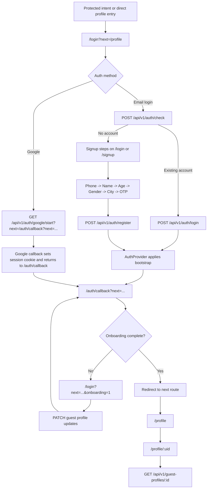

# Guest Portal Auth Flow

This is the canonical guest auth structure for the Guest Portal:

- `/login` is the main auth funnel
- `/signup` is an alias of `/login` in signup mode
- `/login?next=...&onboarding=1` is the onboarding continuation surface
- `/auth/callback` is the session handoff surface
- `/profile` is only a redirect shell into `/profile/:uid`
- `/auth` is a legacy route that immediately redirects into `/login`

